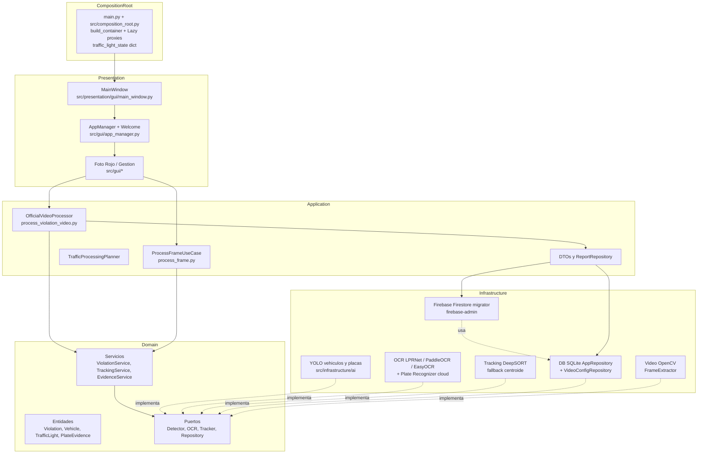
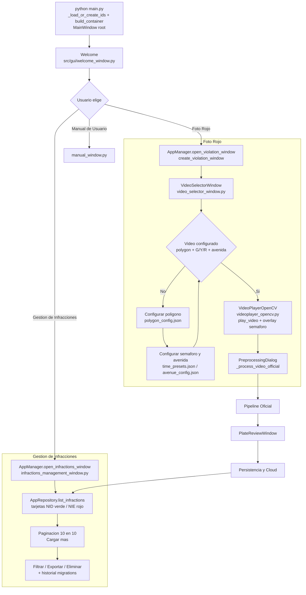
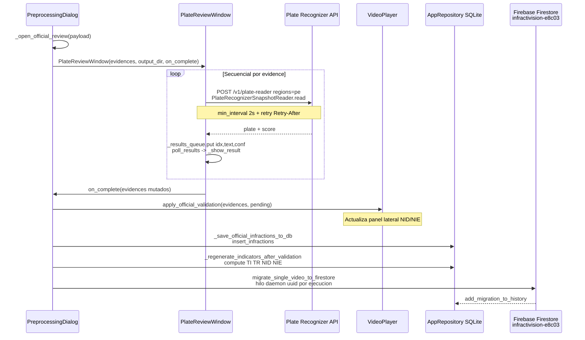
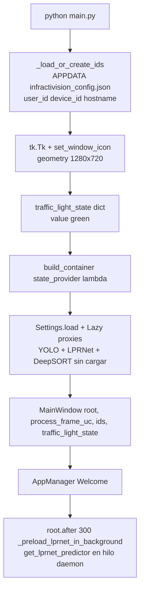
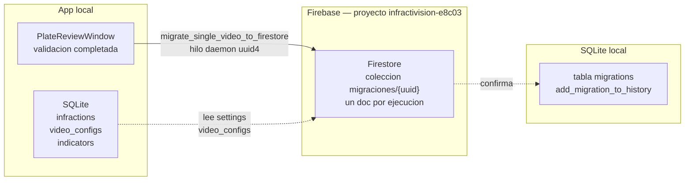

# Flujo del Software — InfractiVision

> Fuente de verdad para cómo funciona el sistema hoy. El README resume el producto; este documento detalla el flujo con diagramas Mermaid.

---

## 1. Arquitectura (Clean Architecture)

El código está organizado en capas con una sola dirección de dependencia: `presentation → application → domain ← infrastructure`. El único lugar que conoce implementaciones concretas es el **Composition Root**.



**Reglas:**

- `main.py:68` crea el `traffic_light_state = {"value": "green"}` y lo inyecta como `state_provider` a `VirtualTrafficLightDetector` (`src/infrastructure/ai/traffic_light_detector.py:22`). El reproductor lo actualiza; el caso de uso solo lo lee.
- `Lazy` (`src/composition_root.py:52`) retrasa la carga de YOLO/LPRNet/DeepSORT hasta el primer uso. El arranque queda en < 0.1 s; la precarga de LPRNet se lanza en background con `root.after(300, _preload_lprnet_in_background)` (`main.py:81`).
- `Settings` (`config/settings.py:57`) viaja por DI; ningún caso de uso lee `os.getenv` directamente.

---

## 2. Flujo de Usuario (GUI)



**Notas de la GUI:**

- `WelcomeFrame` limita la imagen a 1920×1080 y redimensiona con debounce de 200 ms (`src/gui/welcome_window.py:37`).
- `VideoSelectorWindow` carga miniaturas y metadatos en hilos y publica a Tk vía `queue.Queue` + `_safe_*` wrappers (`src/gui/video_selector_window.py:204`).
- `PreprocessingDialog` nunca toca Tk desde el worker: encola `official_frame` / `official_infraction` / `official_complete` en `result_queue` y el hilo de Tk los drena (`_process_results_queue`, `src/gui/preprocessing_dialog.py:749`). Al entrar a validación congela semáforo y timer (ver memoria del bugfix).
- `PlateReviewWindow` publica resultados OCR en `_results_queue` y un poller `after(50)` los aplica (`src/presentation/gui/plate_review_window.py:30`).

---

## 3. Pipeline Oficial (por video)

`src/application/use_cases/process_violation_video.py:140` — `OfficialVideoProcessor.process(video_path, config, output_dir, callback)`.

```mermaid
flowchart TD
    A[Inicio<br/>_ensure_models + VideoCapture<br/>TrafficProcessingPlanner G/Y/R] --> B[Loop por frame_index]
    B --> C[state_at frame_index<br/>G / Y / R]
    C --> D{should_detect<br/>t >= red_start - pre_red 0.5s}
    D -- No --> E[should_display cada green_skip_rate=60<br/>mantener solo infractores confirmados en overlay]
    E --> F[_draw + writer.write si should_display<br/>callback frame]
    F --> B
    D -- Si --> G[YOLO vehiculos conf 0.40<br/>filtrar class_id 2/5/7]
    G --> H[CentroidVehicleTracker.update]
    H --> I{Para cada track<br/>_near_polygon centro inferior}
    I -- Fuera y no confirmado --> G
    I -- Dentro o pendiente --> J[Recortar vehiculo<br/>quadrant inferior]
    J --> K[YOLO placas conf 0.40<br/>sobre quadrant]
    K --> L{crop viable<br/>evidence_crop con margen 50%<br/>w>=55 h>=30}
    L -- No viable --> M[Guardar pending<br/>crop vehiculo + pending_quality<br/>-> NIE amarillo]
    M --> N[Continuar siguiente track]
    L -- Viable --> O[Scoring calidad<br/>contraste 0.3 + bordes 0.3 + nitidez 0.25 + tamano 0.15]
    O --> P{pending en rojo<br/>y placa encontrada}
    P -- Primera vez en rojo dentro --> Q[confirmed_at track = frame_index<br/>callback infraction_detected]
    Q --> R{quality >= best previo}
    P -- Ya confirmado, mejor calidad --> R
    P -- No cruzo en rojo --> N
    R -- Si --> S[Guardar best evidence<br/>crops /nombre_v{track}_best.jpg<br/>PlateEvidence quality]
    R -- No --> N
    S --> T[_draw poligono + boxes<br/>INFRACCION rojo / PENDIENTE amarillo / NORMAL verde<br/>banner SEMAFORO + T + G/Y/R]
    T --> U{callback frame si should_display}
    U --> V{Fin de video cap.read}
    V -- No --> B
    V -- Si --> W[Payload<br/>evidence[] + pending_infractions[]<br/>infractor_count + fps + duration]
    W --> X[ReportRepository.save_processing<br/>nombre_report.json]
    X --> Y[callback complete -> _open_official_review]
```

**Detalles clave:**

- `TrafficProcessingPlanner` (`src/application/services/traffic_processing_planner.py:16`): ciclo determinista `t = (frame/fps) % (G+Y+R)`. `should_detect` incluye `pre_red_seconds` (0.5 s antes del rojo) para capturar el momento del cruce.
- `CentroidVehicleTracker` es el tracker del pipeline oficial; `DeepSortTracker` (`src/infrastructure/tracking/deepsort_tracker.py`) se usa en el `ProcessFrameUseCase` por DI.
- `_near_polygon` usa `cv2.pointPolygonTest` sobre el centro inferior del bbox (ruedas) con margen `danger_zone_margin_pixels` (80 px).
- El video de salida se escribe con `cv2.VideoWriter` solo en `should_display` para no duplicar frames verdes.
- Detección nocturna: el pipeline oficial no cambia el flujo; el modo nocturno legacy (`src/core/video/videoplayer_opencv.py:1618` + `src/gui/preprocessing_dialog.py:4139`) ajusta confianza a 0.25 y aplica realce si `brillo < 60` o el nombre contiene `night`/`nocturno`.

---

## 4. Validación, Persistencia y Cloud



**Reglas de validación:**

- `PlateReviewWindow._process_next` (`src/presentation/gui/plate_review_window.py:132`) procesa de a uno, con `_wait_between_requests` de 2 s (`src/infrastructure/ocr/cloud_plate_readers.py:34`) y reintentos 429 con backoff.
- El texto se normaliza con `normalize_plate` (solo A-Z0-9, mayúsculas). Si `PLATE_RECOGNIZER_API_TOKEN` falta, `read()` lanza `RuntimeError`.
- `NID` = `evidence.validated and plate_text` (check habilitado solo si hubo texto); `NIE` = resto + `pending_infractions` (vehículos que cruzaron en rojo sin placa viable).
- `AppRepository.compute_indicators_report` calcula `TI = NID/(NID+NIE)*100` y `TR = duración / NID` en minutos por infracción.
- `firestore_migrator.migrate_single_video_to_firestore` (`src/automations/firestore_migrator.py:153`) usa `uuid4()` como ID de documento para permitir re-procesar el mismo video sin sobrescribir. Lee `settings` desde `video_configs` en SQLite.

---

## 5. Configuración y Datos

```mermaid
flowchart LR
    subgraph ConfigFiles [Archivos de configuracion]
        C1[config/polygon_config.json<br/>video -> [[x,y],...]]
        C2[config/time_presets.json<br/>video -> green/yellow/red]
        C3[config/avenue_config.json<br/>video -> avenida]
        C4[config/zones.json<br/>stop_line + intersection_polygon]
        C5[config/settings.py<br/>INFRACTI_* env]
    end
    subgraph Repo [VideoConfigRepository]
        R1[get video_name<br/>polygon + preset + avenue<br/>-> VideoConfig]
    end
    subgraph DB [SQLite infractions.sqlite]
        D1[infractions]
        D2[video_configs]
        D3[indicators]
        D4[migrations]
    end
    subgraph Cloud [Firebase Firestore]
        F1[migraciones/uuid<br/>ti tr NID NIE<br/>video-name fecha<br/>settings deteccion]
    end

    C1 --> R1
    C2 --> R1
    C3 --> R1
    C4 --> R1
    C5 --> R1
    R1 --> D2
    D1 --> D3
    D1 --> F1
    D2 --> F1
```

- `VideoConfig` (`src/infrastructure/configuration/video_config_repository.py:10`): `video_name`, `polygon`, `green/yellow/red`, `avenue`, `danger_zone_margin_pixels=80`, `pre_red_seconds=0.5`, `green_skip_rate=60`.
- `VideoConfigRepository.require()` falla si falta polígono o G/Y/R — el diálogo muestra error y no inicia el pipeline.
- `ReportRepository.save_processing` escribe `data/output/official/{video}_report.json`; `export_validated` genera `reporte_placas_validadas.json/.csv` en el mismo `output_dir`.

---

## 6. Arranque



---

## 7. Tecnologías y Migración a Firebase

### 7.1 Stack por capa del flujo

Cada capa usa un set de librerías pineadas en `requirements.txt:1` (Python 3.10 fijo en `mise.toml`). Precaución: `torch 1.13.1` exige `numpy<2` y `opencv-python >=5` exige `numpy>=2` — por eso `numpy==1.26.4` + `opencv-python==4.9.0.80` no se tocan sin testear.

| Capa | Tecnología | Versión | Dónde se usa en el flujo |
|------|-----------|---------|--------------------------|
| Lenguaje | Python | 3.10 | Todo el flujo |
| GUI | Tkinter (stdlib) + tkcalendar | — / 1.6.1 | `src/gui/*`, `src/presentation/gui/*` — Welcome, selector, reproductor, diálogos |
| Video | OpenCV (`opencv-python`) | 4.9.0.80 | `src/core/video/videoplayer_opencv.py` — `VideoCapture`, `VideoWriter`, overlays, `pointPolygonTest` |
| Detección | YOLOv8 (`ultralytics`) | 8.4.120 | `src/infrastructure/ai/yolo_detector.py` — vehículos (car/bus/truck, clases 2/5/7) y placas |
| Deep Learning | PyTorch + CUDA 11.7 | 1.13.1+cu117 / 0.14.1+cu117 | Inferencia YOLO y LPRNet (ver pins críticos en `requirements.txt:1`) |
| OCR primario | LPRNet Perú | — (`LPRNet_Peru_MASTER_FINAL.pth`) | `src/core/ocr/lprnet_engine.py`, `src/infrastructure/ocr/lprnet_reader.py` — singleton `get_lprnet_predictor()` con precarga en background |
| OCR alternos | PaddleOCR / EasyOCR | opcionales (`requirements-ocr.txt:1`) | `src/infrastructure/ocr/paddleocr_reader.py`, `easyocr_reader.py` — seleccionables por `INFRACTI_OCR_BACKEND` |
| OCR validación cloud | Plate Recognizer API | — (`requests`) | `src/infrastructure/ocr/cloud_plate_readers.py:23` — `regions=pe`, `min_interval 2s`, retry `Retry-After` |
| OCR corrección | SmartPlateCorrector | — | `src/infrastructure/ocr/plate_corrector.py` — mapas 0↔O, 1↔I, validación SIIV MTC |
| Tracking | DeepSORT (`deep-sort-realtime`) | 1.3.2 | `src/infrastructure/tracking/deepsort_tracker.py` — usado en `ProcessFrameUseCase`; pipeline oficial usa `CentroidVehicleTracker` con fallback |
| Datos/numérico | NumPy, SciPy, scikit-learn, scikit-image, pandas, openpyxl | 1.26.4 / 1.11.4 / 1.4.2 / 0.23.2 / 2.1.4 / 3.1.5 | Scoring de calidad del crop (contraste+bordes+nitidez+tamaño), `scipy`/`sklearn` en `preprocessing_dialog`, `pandas`/`openpyxl` en exportación |
| Imagen | Pillow, Matplotlib | 10.4.0 / 3.9.4 | Thumbnails, iconos, `auto_rectifier` |
| Persistencia local | SQLite (`AppRepository`) | stdlib `sqlite3` | `src/infrastructure/database/app_repository.py:45` — `infractions`, `video_configs`, `indicators`, `migrations` — fuente única de verdad |
| Config/DI | `python-dotenv`, `Settings` | 1.0.1 | `config/settings.py:57` — `INFRACTI_*` via DI, nunca `os.getenv` en casos de uso |
| Cloud — Migración | **Firebase** (`firebase-admin` + `google-cloud-firestore`) | 7.5.0 / 2.28.1 | `src/automations/firestore_migrator.py:153` — destino de migraciones (ver §7.2) |
| Cloud — Storage | `google-cloud-storage` | 3.13.1 | `src/automations/cloud_migrator.py:61` — legacy, evidencias a bucket `infractivision-474103` |
| Distribución | PyInstaller | 6.11.1 | `InfractiVision.spec` |
| Utilidades | `psutil`, `requests`, `Flask` | 5.9.8 / 2.32.3 / 3.1.3 | Monitoreo, HTTP, API opcional |

### 7.2 ¿A dónde van las migraciones? → Firebase

> **Todas las migraciones del flujo oficial van a Firebase Firestore.** No hay otro destino activo.



**Cuándo se dispara:**
- Al completar la validación en `PlateReviewWindow` (botón *Completado*), no al terminar el vídeo. `src/gui/preprocessing_dialog.py:1388` lanza `migrate_single_video_to_firestore(nombre_video, session_infractions)` en un **hilo `daemon`** para no bloquear la UI.

**Destino exacto:**
- **Proyecto**: `infractivision-e8c03` (`firestore_migrator.py:30`)
- **Colección**: `migraciones` — **documento `{uuid4()}`** por ejecución (`firestore_migrator.py:186`). Permite re-procesar el mismo vídeo sin sobrescribir.
- **Autenticación**: Service Account JSON `infractivision-e8c03-firebase-adminsdk-fbsvc-957f584093.json` en raíz (`firestore_migrator.py:29` + `src/path_helper.py:resource_path`). Sin credenciales, la app sigue 100% offline; solo falla la migración.

**Esquema del documento** (`firestore_migrator.py:145`):

```json
{
  "ti": 75.0,
  "tr": 0.42,
  "NID": 3,
  "NIE": 1,
  "video-name": "Av-Condorcanqui.mp4",
  "fecha": "2026-08-19T14:30:00",
  "settings": {
    "red": 10, "green": 12, "yellow": 2,
    "polygon": [{"x": 200, "y": 300}, {"x": 1080, "y": 300}]
  },
  "deteccion": [
    {"placa": "T4A-123", "timestamp": "2026-08-19T14:30:05", "confianza": 0.87, "validate": true}
  ]
}
```

- `ti`/`tr`/`NID`/`NIE` se calculan **solo sobre la sesión validada** (`_build_video_document`, `firestore_migrator.py:123`), coherentes con `AppRepository.compute_indicators_report`.
- `settings` se lee desde SQLite `video_configs` (`_settings_for_from_db`, `firestore_migrator.py:33`).
- `deteccion[].validate == true` ⇔ `clasificacion == "NID"`.

**Histórico local:** tras cada migración exitosa, `add_migration_to_history` registra el intento en la tabla SQLite `migrations` (visible en *Gestión de Infracciones → historial migraciones*).

**Legacy — `cloud_migrator.py`:** `src/automations/cloud_migrator.py:61` (proyecto `infractivision-474103`) sube evidencias a **Cloud Storage** y escribe en Firestore bajo `usuarios/{user_id}/videos/...`. No es parte del flujo oficial actual; el flujo documentado usa exclusivamente `firestore_migrator.py`.

---

## Referencias

| Pieza | Archivo |
|-------|---------|
| Composition Root | `main.py:1`, `src/composition_root.py:1` |
| Pipeline oficial | `src/application/use_cases/process_violation_video.py:33` |
| Planificador semáforo | `src/application/services/traffic_processing_planner.py:5` |
| Validación placas | `src/presentation/gui/plate_review_window.py:17`, `src/infrastructure/ocr/cloud_plate_readers.py:23` |
| Persistencia SQLite | `src/infrastructure/database/app_repository.py:132` |
| Migración Firebase (Firestore) | `src/automations/firestore_migrator.py:153` |
| Migración legacy (Storage) | `src/automations/cloud_migrator.py:61` |
| Stack pineado | `requirements.txt:1`, `mise.toml:1` |
| Config por video | `src/infrastructure/configuration/video_config_repository.py:26` |
| OCR LPRNet | `src/core/ocr/recognizer.py:48`, `src/core/ocr/lprnet_engine.py` |
| Settings | `config/settings.py:1` |
