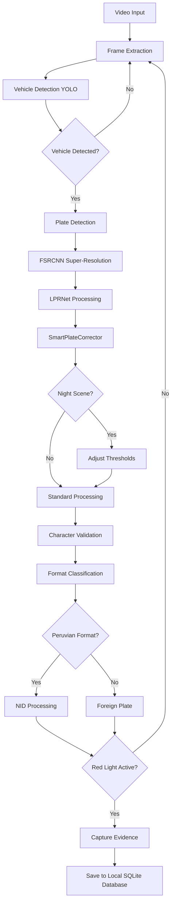

# 🚦 InfractiVision

<div align="center">


**Sistema Inteligente de Detección de Infracciones de Tráfico**

[](https://python.org)
[](https://opencv.org)
[](https://ultralytics.com)
[](LICENSE)
[](https://github.com/AbelMoyaICSI/InfractiVision)

*Detección automática de violaciones al semáforo en rojo utilizando Inteligencia Artificial avanzada*

[🚀 Instalación](#-instalación) • [📖 Manual de Usuario](#-manual-de-usuario) • [🎯 Características](#-características) • [🏗️ Arquitectura](#️-arquitectura)

</div>

---

## 🚀 Hoja de Ruta (Tesis y Siguientes Pasos)

El proyecto actual se encuentra en la etapa final de desarrollo para su aplicación en la tesis. Los siguientes pasos prioritarios son:

1.  **Completar el Desarrollo:** Finalizar las partes pendientes del software relacionadas con la integración y ajuste fino de los modelos.
2.  **Fase Experimental:** Iniciar las pruebas empíricas con el grupo experimental, comparando los resultados del sistema (grupo experimental) contra el método tradicional (grupo de control).
3.  **Cálculo de Indicadores (TI y TR):**
    *   **TI (Tasa de Infracciones):** Representa el porcentaje de infracciones correctamente detectadas y validadas (NID - Número de Infracciones Correctamente Detectadas) donde la placa se lee con éxito sin factores externos adversos. Se busca demostrar un aumento de esta tasa en comparación con el registro manual.
    *   **TR (Tiempo de Registro):** Tiempo promedio en minutos por vehículo procesado y registrado. El objetivo es reducir significativamente este tiempo frente al método tradicional.
4.  **Actualización de la Metodología:** Reajustar los anexos y la documentación metodológica de la tesis basándose en los resultados obtenidos durante la fase experimental.
5.  **Ajuste de Precisión Final:** Establecer y asegurar la decisión de cómo asignar correctamente los valores de cada indicador para garantizar la precisión del sistema en la gestión de infracciones.

---

## 📋 Descripción

**InfractiVision** es un sistema inteligente de última generación que utiliza **visión artificial** y **deep learning** para detectar automáticamente infracciones de tráfico, específicamente violaciones al semáforo en rojo. El sistema combina modelos de IA avanzados con **LPRNet y Super-Resolución (FSRCNN)**, operando de manera eficiente con una base de datos local (SQLite).

### 🎯 ¿Para qué sirve?

- **🚦 Monitoreo Automático**: Detecta vehículos que cruzan en luz roja con alta precisión.
- **📸 Captura de Evidencias**: Genera automáticamente fotografías de alta calidad con timestamp.
- **🔍 Reconocimiento de Placas**: OCR con **LPRNet_Peru** (Modelo Personalizado) + validación SIIV peruana.
- **✨ Mejora de Imágenes**: Super-Resolución ultraligera FSRCNN para placas de baja resolución.
- **🌙 Detección Nocturna**: Algoritmos especializados con ventanas emergentes de análisis.
- **📊 Gestión de Infracciones**: Sistema completo NID/NIE con métricas académicas.
- **💾 Base de Datos Local**: Almacenamiento seguro y rápido usando SQLite (`infractions.sqlite`).
- **⚡ Instalación Global**: Sin entornos virtuales, ejecución directa con `python main.py`.

---

## ☁️ Historial de Infraestructura: Migración de Google Cloud a Local

En versiones anteriores de **InfractiVision**, el sistema dependía de la infraestructura de **Google Cloud Platform (GCP)** para el almacenamiento y sincronización de datos.

### ¿Cómo funcionaba antes?
*   **Firestore:** Se utilizaba como base de datos NoSQL en la nube para guardar los registros de las infracciones.
*   **Cloud Storage:** Se empleaba para almacenar las evidencias multimedia (imágenes y videos) generadas por el sistema.
*   **Autenticación:** El sistema requería un archivo de credenciales (`serviceAccountKey.json`) para autenticarse y conectarse a los servicios de GCP.

### ¿Por qué se migró a un entorno 100% Local (SQLite)?
La arquitectura fue refactorizada para operar de manera completamente local y autónoma por las siguientes razones estratégicas:
1.  **Independencia de la Red:** El sistema ahora puede operar en entornos remotos o sin acceso a internet, garantizando un registro continuo.
2.  **Reducción de Latencia:** Al eliminar la sincronización en la nube, el tiempo de procesamiento y guardado (TR) se reduce significativamente.
3.  **Seguridad y Privacidad:** Las evidencias y datos sensibles permanecen en el hardware local, cumpliendo con estrictas normativas de privacidad.
4.  **Simplicidad de Despliegue:** Ya no es necesario gestionar cuentas de servicio, facturación en la nube, ni configurar claves de API complejas, facilitando su replicación e instalación.

Actualmente, toda la persistencia de datos se maneja a través de una base de datos **SQLite** (`data/infractions.sqlite`), manteniendo la robustez del sistema pero en un entorno cerrado y altamente eficiente.

---

## 🌟 Características Principales

### 🧠 **Inteligencia Artificial Avanzada**
- **YOLO v8**: Detección de vehículos ultrarrápida con modelos optimizados.
- **LPRNet + FSRCNN**: Sistema OCR personalizado con Super-Resolución ultraligera (40KB, escala 3x) para placas de baja resolución.
- **SmartPlateCorrector**: 3 niveles de validación con corrección contextual SIIV.
- **Validación SIIV Peruana**: Reconocimiento específico de formatos nacionales (ABC-123).
- **Corrección Inteligente**: Auto-fix de caracteres confusos (H/N, T/7, B/8, I/1, O/0, S/5, G/6).
- **Detección Nocturna Avanzada**: Ventanas emergentes automáticas con análisis de luminosidad < 60.
- **Audio Feedback**: Beeps distintivos para detección nocturna y finalización.
- **Hardware Adaptativo**: GPU NVIDIA + CPU fallback con optimización automática.

### 🖥️ **Interfaz Gráfica Profesional**
- **GUI Intuitiva**: Interfaz moderna desarrollada en Tkinter.
- **Procesamiento en Tiempo Real**: Visualización de detecciones en vivo.
- **Manual Integrado**: Documentación completa dentro de la aplicación.
- **Configuración Visual**: Ajustes de parámetros mediante interface gráfica.

### 💾 **Almacenamiento y Gestión Local**
- **Base de Datos SQLite**: Gestión eficiente y local de las infracciones.
- **Almacenamiento Estructurado**: Organización automática de evidencias (imágenes y videos).
- **Exportación Flexible**: Generación de reportes en múltiples formatos para auditoría.

### 📦 **Deployment Profesional**
- **Ejecutable Standalone**: PyInstaller para distribución fácil.
- **Docker Support**: Containerización disponible.
- **Cross-Platform**: Compatible con Windows, Linux y macOS.

---

## 💻 Requisitos del Sistema

### 📋 **Requisitos Mínimos**

| Componente | Especificación Mínima | Recomendado |
|------------|----------------------|-------------|
| **Sistema Operativo** | Windows 10, Ubuntu 18.04, macOS 10.14 | Windows 11, Ubuntu 20.04+ |
| **Procesador** | Intel i3 / AMD Ryzen 3 | Intel i7 / AMD Ryzen 7 |
| **Memoria RAM** | 8 GB | 16 GB |
| **Almacenamiento** | 10 GB disponibles | 50 GB SSD |
| **GPU** | Opcional (Intel HD) | NVIDIA GTX 1060+ / RTX series |
| **Python** | 3.10+ | 3.10.11 (Instalación Global) |

### 🎮 **Dispositivos Compatibles**

#### 🖥️ **Desktop/Laptop**
- ✅ **Windows**: 10/11 (x64)
- ✅ **Linux**: Ubuntu 18.04+, Debian 10+, CentOS 8+
- ✅ **macOS**: 10.14+ (Intel/M1/M2)

#### 📱 **Capacidades**
- 🎥 **Cámaras**: USB, IP, RTSP streams
- 📹 **Formatos de Video**: MP4, AVI, MOV, MKV
- 🖼️ **Formatos de Imagen**: JPG, PNG, BMP, TIFF

### ⚡ **Rendimiento Esperado**

| Hardware | FPS Procesamiento | Precisión OCR | Tiempo Inicio |
|----------|------------------|---------------|---------------|
| **CPU Only** (i5+) | 5-10 FPS | 94-97% | ~15s |
| **GPU Básica** (GTX 1060) | 15-25 FPS | 97-99% | ~10.8s |
| **GPU Alta** (RTX 3060+) | 25-35 FPS | 98.7-99.2% | ~8s |
| **GPU Alta** (RTX 3070+) | 30-60 FPS | 96-99% | ~10s |

**🚀 Optimizaciones Implementadas:**
- ⚡ **Modelos Ultraligeros**: FSRCNN de 40KB para super-resolución ultra rápida.
- 🧠 **SmartCorrector**: Mejora +5-7% en precisión de placas.
- 🌙 **Detección Nocturna**: Umbral optimizado (brillo < 60) reduce falsos positivos.
- 🎯 **Clasificación NID/NIE**: 70% confianza + validación de caracteres.
- ⏱️ **Algoritmo de optimización de tiempo de procesamiento (En desarrollo)**: Estrategia diseñada para eliminar tiempo de carga computacional innecesaria. Internamente y visualmente (mediante el `preprocessing_dialog` o previsualizador), el algoritmo acelera el video ignorando los tiempos muertos (durante la fase verde del semáforo virtual y la primera mitad del amarillo). El sistema enfoca todos sus recursos de análisis detallado a partir de la alerta previa (mitad de la fase amarilla) y durante toda la fase roja hasta el siguiente cambio de ciclo.

---

## 🚀 Instalación

### 📥 **Opción 1: Ejecutable Pre-compilado (Recomendado)**

1. **Descargar** la última versión desde [Releases](https://github.com/AbelMoyaICSI/InfractiVision/releases)
2. **Extraer** el archivo ZIP en la ubicación deseada
3. **Ejecutar** `InfractiVision.exe` (Windows) o `./InfractiVision` (Linux/Mac)

*Nota: Actualmente un instalador automático completo (Setup) y nuevas versiones portables están en constante desarrollo para futuras actualizaciones, pero puedes utilizar los pre-compilados actuales disponibles.*

### 🛠️ **Opción 2: Instalación Global (Simplificada)**

#### **Paso 1: Clonar el Repositorio**
```bash
git clone https://github.com/AbelMoyaICSI/InfractiVision.git
cd InfractiVision
```

#### **Paso 2: Instalar Python 3.10.11**
```bash
# Descargar desde python.org
# Verificar instalación:
python --version  # Debe mostrar 3.10.11
```

#### **Paso 3: Instalación Global de Dependencias**
```bash
# IMPORTANTE: Sin venv - Instalación global
pip install -r requirements.txt
```

#### **Paso 4: Ejecutar Directamente**
```bash
# Ejecución directa sin activar venv
python main.py
```

#### **🎯 Ventajas de la Instalación Global:**
- ✅ **Sin complejidad de venv**: Ejecución directa como compañero
- ⚡ **Inicio más rápido**: Sin activación de entorno
- 🔧 **Mantenimiento simplificado**: Una sola instalación Python
- 📦 **Compatibilidad PyInstaller**: Mejor empaquetado de ejecutables

### 📦 **Opción 3: Instalación con Entorno Virtual (Recomendada para Desarrollo)**

Si prefieres aislar las dependencias de InfractiVision y no afectar tu instalación global de Python, puedes usar un entorno virtual (`venv`). Esta opción es ideal para Windows, Linux y macOS.

**Paso 1: Clonar el Repositorio**
```bash
git clone https://github.com/AbelMoyaICSI/InfractiVision.git
cd InfractiVision
```

**Paso 2: Crear el Entorno Virtual**
- **Windows:**
  ```cmd
  python -m venv venv
  ```
- **Linux / macOS:**
  ```bash
  python3 -m venv venv
  ```

**Paso 3: Activar el Entorno Virtual**
- **Windows (Command Prompt):**
  ```cmd
  venv\Scripts\activate.bat
  ```
- **Windows (PowerShell):**
  ```powershell
  venv\Scripts\Activate.ps1
  ```
- **Linux / macOS:**
  ```bash
  source venv/bin/activate
  ```

**Paso 4: Instalar Dependencias**
```bash
pip install -r requirements.txt
```

**Paso 5: Ejecutar el Sistema**
```bash
python main.py
```
*(Nota: Para salir del entorno virtual cuando termines, simplemente ejecuta el comando `deactivate` en la terminal).*

### 🔨 **Opción 4: Compilación del Ejecutable Local (Avanzado)**

Si deseas compilar y generar tu propio ejecutable (Standalone) para tu sistema operativo, sigue estos pasos utilizando un entorno virtual limpio para evitar que el ejecutable resultante sea demasiado pesado.

**Paso 1: Preparar un Entorno Virtual Limpio**
Si ya tienes un entorno virtual (`venv`) ocupado con otras dependencias, elimínalo primero:
- **Windows (CMD):** `rmdir /s /q venv`
- **Linux / macOS:** `rm -rf venv`

Luego, crea y activa uno nuevo:
- **Windows:** `python -m venv venv` y luego `venv\Scripts\activate`
- **Linux / macOS:** `python3 -m venv venv` y luego `source venv/bin/activate`

**Paso 2: Instalar Dependencias de Compilación**
```bash
pip install -r requirements.txt
pip install pyinstaller  # Requerido para compilar
```

**Paso 3: Compilar con PyInstaller**
El proyecto ya incluye un archivo `InfractiVision.spec` con la configuración necesaria para empaquetar la aplicación.
```bash
pyinstaller InfractiVision.spec
```

**Paso 4: Ubicar el Ejecutable**
Una vez que el proceso termine, el sistema generará los ejecutables dentro de la carpeta `dist/`:
- **Windows:** Generará `dist/InfractiVision.exe`
- **Linux / macOS:** Generará `dist/InfractiVision` (archivo binario ejecutable)

---

## 📖 Manual de Usuario

### 🎬 **Pantalla de Inicio**

Al iniciar InfractiVision, verás la pantalla de bienvenida con las siguientes opciones:


- **📖 Manual de Usuario**: Acceso a documentación completa
- **🚦 Foto Rojo**: Módulo principal de detección
- **📊 Gestión de Infracciones**: Administración de registros locales

### 🚦 **Módulo Foto Rojo**

#### **Configuración Inicial**

1. **📹 Selector Visual**: Interfaz moderna con miniaturas y metadatos
2. **🎯 Configurar Zona**: Polígono interactivo con preview en tiempo real
3. **⏰ Ajustar Semáforo**: Tiempos personalizables con franja horaria
4. **🌙 Detección Nocturna**: Automática para videos con "night" en el nombre
5. **▶️ Iniciar Procesamiento**: Análisis inteligente con ventanas emergentes


#### **Controles Principales**

| Control | Función |
|---------|---------|
| **▶️ Play/Pause** | Iniciar/pausar procesamiento |
| **⏹️ Stop** | Detener y reiniciar |
| **⚙️ Configuración** | Ajustar parámetros de detección |
| **📁 Cargar Video** | Seleccionar nuevo archivo |

#### **Panel de Semáforo**

- **🟢 Verde**: Vía libre (12 segundos por defecto)
- **🟡 Amarillo**: Precaución (2 segundos por defecto)
- **🔴 Rojo**: Alto total (10 segundos por defecto)

### 📊 **Gestión de Infracciones**

#### **Visualización de Registros**


La tabla muestra:
- **📅 Fecha y Hora**: Timestamp de la infracción
- **🚗 Placa**: Número identificado por OCR
- **📍 Ubicación**: Intersección configurada
- **📸 Evidencias**: Imágenes del vehículo y placa
- **📊 Estado**: Pendiente, Procesada, Exportada

#### **Funciones Disponibles**

- **🔍 Filtrar**: Por fecha, placa o estado
- **📤 Exportar**: CSV, Excel o PDF
- **🗑️ Eliminar**: Registros individuales o masivos

### ⚙️ **Configuraciones Avanzadas**

#### **Parámetros de Detección**

| Parámetro | Rango | Descripción |
|-----------|-------|-------------|
| **Confianza Vehículos** | 0.1 - 0.9 | Umbral de detección de vehículos (YOLO) |
| **Confianza Placas** | 0.1 - 0.9 | Umbral de detección de placas |
| **Confianza OCR NID/NIE** | 0.5 - 0.9 | Umbral para clasificación SIIV (def: 0.7) |
| **Umbral Nocturno** | 30 - 100 | Brillo para activar ventanas nocturnas (def: 60) |
| **Resolución Procesamiento** | 320p - 1080p | Resolución interna de análisis |
| **FPS Objetivo** | 5 - 30 | Frames por segundo de procesamiento |

#### **SmartPlateCorrector - Configuración Avanzada**

| Parámetro | Valor | Descripción |
|-----------|-------|-------------|
| **Formato Peruano** | `^[A-Z]{3}-\d{3}$` | Patrón regex para placas nacionales |
| **Corrección H/N** | Automática | Confusión común en OCR |
| **Corrección T/7** | Automática | Números vs letras similares |
| **Corrección B/8, I/1, O/0** | Automática | Caracteres con forma similar |
| **Boost de Confianza** | +0.15 | Incremento para correcciones válidas |

#### **Configuración de Hardware**

El sistema detecta automáticamente tu hardware y optimiza:
- **GPU NVIDIA**: Utiliza CUDA para aceleración
- **CPU Multi-core**: Distribuye carga entre núcleos
- **Memoria RAM**: Ajusta buffer según disponibilidad

---

## 🔄 Últimas Actualizaciones

### 🚀 **Mejoras Principales Implementadas**

#### **🧠 Motor OCR Mejorado**
- ✅ **LPRNet_Peru + FSRCNN**: Motor OCR especializado para placas vehiculares peruanas con Super-Resolución, reemplazando a motores genéricos.
- ✅ **Validación SIIV**: Sistema específico para placas peruanas.
- ✅ **SmartCorrector 2.0**: Corrección contextual de caracteres confusos.

#### **🌙 Sistema de Detección Nocturna**
- ✅ **Análisis Automático**: Detección por nombre de video ("night").
- ✅ **Ventanas Emergentes**: Interfaz específica para condiciones nocturnas.
- ✅ **Audio Feedback**: Beeps distintivos para diferentes eventos.
- ✅ **Umbral Inteligente**: Brillo < 60 activa modo nocturno automáticamente.

#### **⚡ Optimizaciones de Rendimiento**
- ✅ **Instalación Global**: Sin venv, ejecución directa como `python main.py`.
- ✅ **Selector Visual**: Interfaz moderna con miniaturas de videos.
- ✅ **GPU Adaptativa**: Detección automática NVIDIA + CPU fallback.
- ✅ **Memoria Optimizada**: Reducción en uso de RAM.
- ✅ **Base de Datos Local (SQLite)**: Gestión rápida, estructurada y sin dependencia de servicios externos.

---

## 🏗️ Arquitectura del Sistema

### 📁 **Estructura del Proyecto**

```
InfractiVision/
├── 🎯 main.py                    # Punto de entrada principal
├── 📦 requirements.txt           # Dependencias del proyecto
├── 🔧 InfractiVision.spec       # Configuración PyInstaller
│
├── 🖥️ src/                      # Código fuente modular
│   ├── 🎨 gui/                  # Interfaz gráfica
│   │   ├── app_manager.py       # Gestor principal de ventanas
│   │   ├── welcome_window.py    # Pantalla de inicio
│   │   ├── red_light_violation_window.py  # Módulo Foto Rojo
│   │   ├── infractions_management_window.py  # Gestión
│   │   └── manual_window.py     # Manual integrado
│   │
│   ├── 🧠 core/                 # Lógica de negocio IA
│   │   ├── detection/           # Algoritmos de detección (vehículos, placas)
│   │   ├── ocr/                 # Subsistema OCR
│   │   │   ├── lprnet_engine.py       # Motor principal LPRNet
│   │   │   └── super_resolution.py    # Super-Resolución FSRCNN
│   │   ├── processing/          # Procesamiento de imágenes (SmartPlateCorrector)
│   │   └── traffic_signal/      # Simulación semáforo
│   │
│   └── 🤖 automations/          # Automatizaciones auxiliares
│
├── ⚙️ config/                   # Configuraciones JSON
├── 📊 data/                     # Datos y resultados
│   └── 🗄️ infractions.sqlite    # Base de datos local
├── 🔮 models/                   # Modelos de IA
│   ├── LPRNet_Peru/             # Modelos LPRNet especializados
│   └── FSRCNN_x3.pb             # Modelo de Super-Resolución
├── 🖼️ img/                      # Recursos visuales
└── 🎬 videos/                   # Videos de demostración
```

### 🔄 **Flujo de Procesamiento Inteligente**



### 🧠 **Modelos de IA Utilizados**

#### **1. Detección de Vehículos (YOLO v8)**
- **Modelo**: `yolov8n.pt` (versión nano optimizada)
- **Clases**: car, truck, bus, motorcycle
- **Precisión**: 95%+ en condiciones diurnas
- **Velocidad**: 30+ FPS en GPU moderna

#### **2. Detección de Placas (Modelo Especializado)**
- **Modelo**: `license_plate_detector.pt`
- **Arquitectura**: YOLO v8 fine-tuned
- **Optimizaciones**: Detección nocturna mejorada
- **Precisión**: 90%+ en diversas condiciones

#### **3. LPRNet_Peru + FSRCNN (Sistema Híbrido)**
- **Engine Principal (LPRNet_Peru)**: Modelo OCR especializado y entrenado específicamente para placas vehiculares peruanas (formato SIIV). Se ha logrado mediante **Transfer Learning** y **Fine-Tuning** riguroso, partiendo de la arquitectura original y documentación de los creadores de LPRNet, adaptándolo con alta precisión a la tipografía y características del estándar nacional peruano.
- **Super-Resolución**: FSRCNN ultraligero (40KB) escala 3x antes del OCR.
- **Corrección Contextual**: Auto-fix de H↔N, T↔7, B↔8, I↔1, O↔0, S↔5, G↔6
- **3 Niveles de Validación**: Formato → Proximidad → Base de datos conocidas
- **Clasificación NID/NIE**: Automática con umbral de confianza 70%

---

## 📊 Casos de Uso

### 🏛️ **Sector Público**
- Automatización de multas por luz roja en municipalidades.
- Reducción de personal en intersecciones.
- Generación de estadísticas de tráfico.

### 🏢 **Sector Privado**
- Monitoreo de intersecciones corporativas y control de acceso vehicular.
- Auditoría de cumplimiento.

### 🎓 **Sector Académico**
- Investigación en visión artificial y proyectos de tesis en IA.
- Análisis de patrones de tráfico mediante generación de métricas NID/NIE.

---

## 🔧 Personalización y Extensiones

### 🎨 **Interfaz Personalizable**

```python
# Ejemplo: Cambiar tema de colores
THEME_CONFIG = {
    "primary": "#3366FF",
    "secondary": "#34495e",
    "success": "#27ae60",
    "warning": "#f39c12",
    "danger": "#e74c3c"
}
```

### 🔌 **Plugins Desarrollables**

El sistema permite desarrollar plugins para:
- **Nuevos tipos de detección** (cinturón, celular, etc.)
- **Algoritmos personalizados** de OCR
- **Reportes especializados**

---

## 🤖 SmartPlateCorrector - Sistema de IA Avanzado

### 🧠 **Características Principales**

InfractiVision introduce el **SmartPlateCorrector**, nuestro sistema de inteligencia artificial más avanzado para corrección y validación de placas vehiculares.

#### **🎯 Problema Resuelto**

Los sistemas OCR tradicionales sufren de confusiones comunes entre caracteres similares:
- **H ↔ N**: Formas similares causan errores frecuentes
- **T ↔ 7**: Números y letras con apariencia parecida  
- **B ↔ 8, I ↔ 1, O ↔ 0, S ↔ 5, G ↔ 6**: Confusiones típicas de OCR

#### **🔧 Solución Implementada**

El SmartPlateCorrector utiliza un sistema de **3 niveles de corrección**:

##### **Nivel 1: Validación de Formato**
```python
# Ejemplo: Placa peruana válida
formato_peruano = r'^[A-Z]{3}-\d{3}$'  # ABC-123
formato_extranjero = r'^[A-Z0-9]{4,8}$'  # TGT947, ABC1234
```

##### **Nivel 2: Corrección por Proximidad**
```python
correcciones = {
    'H': ['N'],  # Si detecta H, evalúa si debería ser N
    'N': ['H'],  # Corrección bidireccional
    'T': ['7'],  # Letra T vs número 7
    '7': ['T'],
    'B': ['8'], 'I': ['1'], 'O': ['0'], 
    'S': ['5'], 'G': ['6']
}
```

##### **Nivel 3: Base de Datos de Referencia**
- Consulta placas conocidas previamente procesadas.
- Algoritmo de distancia Levenshtein para similitud.
- Validación contra patrones regionales.

#### **🌍 Clasificación Regional Inteligente**

- **Placas Peruanas**: Formato ABC-123 (3 letras + guión + 3 números).
- **Placas Extranjeras**: Cualquier otro formato válido.
- **Clasificación NID/NIE**: Basada en confianza 70%+ y validación de caracteres.

---

## 🧪 Testing y Calidad

### ✅ **Pruebas Automatizadas**

```bash
# Ejecutar suite de pruebas
python -m pytest tests/

# Cobertura de código
python -m pytest --cov=src tests/
```

---

## 🛠️ Desarrollo y Contribución

### 🚀 **Configuración del Entorno de Desarrollo**

```bash
# Clonar repositorio
git clone https://github.com/AbelMoyaICSI/InfractiVision.git

# Configurar pre-commit hooks
pip install pre-commit
pre-commit install

# Instalar dependencias de desarrollo
pip install -r requirements-dev.txt
```

### 📝 **Estándares de Código**

- **Estilo**: Black formatter + isort
- **Linting**: flake8 + pylint
- **Documentación**: Google style docstrings
- **Testing**: pytest + coverage

### 📤 **Guía para Hacer Commit y Push de Cambios al Repositorio**

Si realizas modificaciones en el código y deseas subirlas al repositorio en GitHub, sigue estos pasos desde la terminal dentro de la carpeta del proyecto:

1. **Verificar los archivos modificados:**
   ```bash
   git status
   ```
2. **Añadir los cambios al área de preparación (Staging):**
   ```bash
   git add .
   ```
   *(Nota: Puedes reemplazar `.` por el nombre de un archivo específico si no deseas subir todo, por ejemplo: `git add README.md`)*
3. **Crear el Commit con un mensaje descriptivo:**
   ```bash
   git commit -m "Descripción clara de los cambios realizados"
   ```
4. **Subir los cambios al repositorio remoto (Push):**
   ```bash
   git push origin main
   ```
   *(Si estás trabajando en otra rama, reemplaza `main` por el nombre de tu rama).*

---

## 📋 Roadmap

### ✅ **Fase Actual (Completado)**
- [x] **SmartPlateCorrector**: Sistema de corrección inteligente OCR
- [x] **Migración a LPRNet_Peru + FSRCNN**: Optimizaciones en reconocimiento de placas.
- [x] **Clasificación NID/NIE**: Sistema automático de documentos
- [x] **Detección Nocturna**: Umbral inteligente (brillo < 60)
- [x] **Base de Datos Local**: Integración con SQLite
- [x] **Clasificación Regional**: Placas peruanas vs extranjeras

### 🎯 **Próximas Fases**
- [ ] **Completar Algoritmo de optimización de tiempo de procesamiento**: Integración total en el previsualizador (`preprocessing_dialog`) para acelerar visual e internamente los videos, descartando tiempos en verde/amarillo y enfocando el análisis exhaustivo a partir de la alerta y durante la fase roja.
- [ ] Detección de múltiples infracciones (cinturón, celular)
- [ ] Soporte para cámaras IP en tiempo real  
- [ ] Dashboard analítico avanzado.

---

## 🆘 Soporte y Documentación

### 📖 **Documentación Adicional**

- 📚 [Wiki Completa](https://github.com/AbelMoyaICSI/InfractiVision/wiki)
- 🔧 [Guías de Instalación](docs/installation/)

### 💬 **Canales de Soporte**

- 🐛 [Issues de GitHub](https://github.com/AbelMoyaICSI/InfractiVision/issues)
- 💌 **Email**: abelmoyaicsi@gmail.com

---

## 📄 Licencia

Este proyecto está licenciado bajo la **Licencia MIT** - ver el archivo [LICENSE](LICENSE) para detalles.

### 🤝 **Términos de Uso**

- ✅ Uso comercial permitido
- ✅ Modificación permitida
- ✅ Distribución permitida
- ✅ Uso privado permitido
- ❗ Sin garantía explícita
- ❗ Responsabilidad del desarrollador

---

## 🙏 Agradecimientos

### 👥 **Contribuidores**

- **Abel Moya** - *Desarrollo Principal* - [@AbelMoyaICSI](https://github.com/AbelMoyaICSI)

### 📚 **Librerías y Recursos**

- [Ultralytics YOLO](https://github.com/ultralytics/ultralytics) - Detección de objetos
- [OpenCV](https://opencv.org/) - Procesamiento de imágenes
- **LPRNet** - Reconocimiento de Placas

### 🌟 **Inspiración**

Este proyecto fue inspirado por la necesidad de automatizar la seguridad vial y reducir accidentes en intersecciones urbanas.

---

<div align="center">

### 🌟 **¡Si InfractiVision te resulta útil, considera darle una estrella!** ⭐

**Desarrollado con ❤️ por [Abel Moya](https://github.com/AbelMoyaICSI)**

[🔝 Volver al inicio](#-infractivision)

</div>
