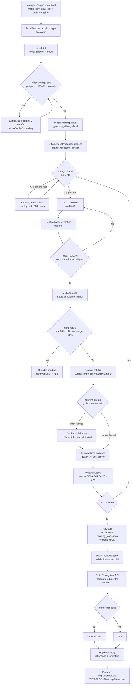

# 🚦 InfractiVision

<div align="center">


**Sistema Inteligente de Detección de Infracciones por Cruce en Rojo**

[](https://python.org)
[](https://opencv.org)
[](https://ultralytics.com)
[](#-modelos-de-ia)
[](LICENSE)
[](https://github.com/AbelMoyaICSI/InfractiVision)

*Detección automática de violaciones al semáforo en rojo con YOLOv8 + LPRNet y validación humana asistida*

[🚀 Instalación](#-instalación) • [📦 Compilar Build](#-compilar-build) • [📖 Manual de Usuario](#-manual-de-usuario) • [🎯 Características](#-características) • [🏗️ Arquitectura](#️-arquitectura) • [🔄 Flujo](#-flujo-de-procesamiento) • [☁️ Cloud](#️-integración-cloud)

</div>

---

## 📋 Descripción

**InfractiVision** detecta vehículos que cruzan en rojo a partir de video grabado. El flujo es **offline por video**: eliges un archivo, configuras la zona y los tiempos del semáforo, procesas, validas las placas y el sistema persiste métricas localmente y las migra a la nube.

### ¿Qué hace realmente?

- **🚦 Detección en rojo**: identifica cruces de un polígono configurable solo durante la fase roja (y un pequeño pre-rojo) del ciclo G → Y → R simulado.
- **🚗 Tracking**: asigna ID por vehículo (centroide / DeepSORT) para evitar duplicados.
- **🔍 Placas**: detecta placas con YOLO dedicado y guarda el mejor crop por infractor (con margen y scoring de calidad).
- **🔤 OCR principal LPRNet**: `LPRNet_Peru_MASTER_FINAL.pth` con contexto regional Trujillo y validación SIIV MTC Perú. Backends alternativos PaddleOCR/EasyOCR seleccionables por env.
- **☁️ Validación en la nube**: `PlateReviewWindow` valida cada crop secuencialmente contra **Plate Recognizer API** (`regions=pe`) con espera anti-límite.
- **📊 NID / NIE**: NID = placas validadas por el operador; NIE = pendientes sin placa o no validados. De ahí se derivan TI y TR.
- **💾 Persistencia local**: SQLite `data/infractions.sqlite` como fuente única.
- **☁️ Migración a Firebase**: Firestore `infractivision-e8c03`, colección `migraciones/{uuid}` con TI/TR/NID/NIE/settings/deteccion (ver [DOC.md §7.2](DOC.md#7-tecnologías-y-migración-a-firebase)).

> Ver el flujo completo con diagramas Mermaid en [DOC.md](DOC.md).

---

## 🌟 Características Principales

### 🧠 Inteligencia Artificial

- **YOLOv8 vehículos** (`yolov8n.pt`): clases 2/5/7 (car/bus/truck), solo en fase roja/pre-roja.
- **YOLO placas** (`license_plate_detector.pt`): sobre cuadrante inferior del vehículo.
- **LPRNet Perú** (`LPRNet_Peru_MASTER_FINAL.pth`): singleton thread-safe con `get_lprnet_predictor()`, precarga en background al arrancar la GUI.
- **SmartPlateCorrector** (`src/infrastructure/ocr/plate_corrector.py`): mapas de confusión (0↔O, 1↔I, 8↔B, etc.) con cache y validación SIIV.
- **Detección nocturna**: por nombre de video (`night`/`nocturno`) o análisis de brillo (< 60) + áreas oscuras. Ajusta confianza y realce de visibilidad.
- **Scoring de calidad** del crop: contraste + bordes + nitidez (Laplaciano) + tamaño.

### 🖥️ Interfaz Gráfica (Tkinter)

- **Welcome** (`src/gui/welcome_window.py`): 3 acciones — *Manual de Usuario*, *Foto Rojo*, *Gestión de Infracciones*. Fondo redimensionado con debounce.
- **Foto Rojo** (`src/gui/red_light_violation_window.py` + `src/core/video/videoplayer_opencv.py`): selector visual de videos (`src/gui/video_selector_window.py`), configuración de polígono/tiempos/avenida, reproductor OpenCV y diálogo de preprocesamiento.
- **PreprocessingDialog** (`src/gui/preprocessing_dialog.py`): orquesta el `OfficialVideoProcessor` en hilo worker y drena resultados a Tk vía cola (`result_queue`). Congela semáforo/timer al entrar a validación.
- **PlateReviewWindow** (`src/presentation/gui/plate_review_window.py`): revisión secuencial de best-crops con Plate Recognizer (cola `queue.Queue` + poller `after(50)` — nunca toca Tk desde el worker).
- **Gestión de Infracciones** (`src/gui/infractions_management_window.py`): tarjetas NID/NIE + paginación de 10 en 10 desde `AppRepository`.

### 🏗️ Arquitectura

- **Clean Architecture** por extracción: `domain/` (entidades, puertos, servicios), `application/` (casos de uso, DTOs), `infrastructure/` (YOLO, OCR, tracking, DB, video), `presentation/` (GUI/API).
- **Composition Root** (`main.py` + `src/composition_root.py`): único lugar que cablea dependencias. `Lazy` proxy para no cargar modelos al arrancar.
- **Multiplataforma**: `src/core/utils/icon.py` (`.ico`/`.png`), `src/core/utils/audio.py` (`winsound`/`paplay`/`afplay`), sin `state("zoomed")` forzado.

### ☁️ Cloud

- **Firebase Firestore** `infractivision-e8c03` vía `firebase-admin 7.5.0` + `firestore_migrator.py:153`. Un documento por ejecución (`migraciones/{uuid}`), no por nombre de video, para no sobrescribir re-procesamientos. Ver [DOC.md §7.2](DOC.md#7-tecnologías-y-migración-a-firebase).
- **Migración al completar validación** (no al terminar el video): un hilo `daemon` (`src/gui/preprocessing_dialog.py:1388`) llama `migrate_single_video_to_firestore()` y registra en `migrations` local. **Destino: Firebase**.

### 📦 Distribución

- **PyInstaller**: `InfractiVision.spec` / `InfractiVision-CPU.spec` / `InfractiVision-CUDA.spec`.
- **CI**: `.github/workflows/deps.yml` (matrix ubuntu+windows, Python 3.10) y `release.yml`.
- **Installer**: `installer/` (stub online multi-OS con detección de GPU).
- **Scripts**: `scripts/` (comparadores OCR, regeneración de indicadores, smoke tests).

---

## 💻 Requisitos del Sistema

| Componente | Mínimo | Recomendado |
|------------|--------|-------------|
| **SO** | Windows 10, Ubuntu 18.04, macOS 10.14 | Windows 11, Ubuntu 20.04+ |
| **CPU** | Intel i3 / Ryzen 3 | Intel i7 / Ryzen 7 |
| **RAM** | 8 GB | 16 GB |
| **Disco** | 10 GB libres | 50 GB SSD |
| **GPU** | Opcional (CPU fallback) | NVIDIA GTX 1650 Ti+ con driver ≥ 450 (CUDA 11.7) |
| **Python** | 3.10 | 3.10 (fijado en `mise.toml`) |

### Stack pineado (no cambiar sin testear)

`torch 1.13.1` fue compilado contra NumPy 1.x → exige `numpy<2`, mientras `opencv-python ≥5` exige `numpy≥2`. Por eso:

| Paquete | Versión fijada | Motivo |
|---------|---------------|--------|
| `numpy` | `1.26.4` | Compatibilidad torch 1.13.1 |
| `opencv-python` | `4.9.0.80` | No 5.x; no headless |
| `torch` | `1.13.1+cu117` | Índice CUDA 11.7 |
| `torchvision` | `0.14.1+cu117` | A juego con torch |
| `scikit-image` | `0.23.2` | Procesamiento |
| `scikit-learn` | `1.4.2` | Métricas |

Ver `requirements.txt:1` y `requirements-cpu.txt` / `requirements-ocr.txt` para variantes. Tkinter viene con Python en Windows/macOS; en Linux: `sudo apt install python3-tk`.

---

## 🚀 Instalación

### Opción 1: Ejecutable

Descarga el ZIP de [Releases](https://github.com/AbelMoyaICSI/InfractiVision/releases), extrae y ejecuta `InfractiVision.exe` (Windows) o `./InfractiVision` (Linux/macOS).

### Opción 2: Desde código

```bash
git clone https://github.com/AbelMoyaICSI/InfractiVision.git
cd InfractiVision

# Python 3.10 (ver mise.toml:1)
python --version  # 3.10.x

# Crear venv (recomendado) e instalar
python -m venv .venv
# Windows: .venv\Scripts\activate
# Linux/macOS: source .venv/bin/activate
pip install -r requirements.txt          # con CUDA 12.4 (torch 2.6.0+cu124, usa --extra-index-url del archivo)
# Alternativas:
# pip install -r requirements-cpu.txt   # sin GPU (torch 2.8.0 CPU, para CI / macOS / PCs sin NVIDIA)
# pip install -r requirements-ocr.txt   # solo OCR de pruebas (PaddleOCR/EasyOCR, NO para build prod)

# Variable para validación en la nube (requerida para Plate Recognizer)
# .env en la raíz (ver .env:1):
# PLATE_RECOGNIZER_API_TOKEN="..."

python main.py
```

### Cloud opcional (Firestore)

1. Proyecto GCP `infractivision-e8c03` con Firestore habilitado.
2. Service Account con `datastore.user` y su JSON en la raíz como `infractivision-e8c03-firebase-adminsdk-fbsvc-957f584093.json` (ver `src/automations/firestore_migrator.py:30`).
3. Sin credenciales, la app funciona 100% offline; solo falla la migración.

---

## 📦 Compilar Build

> Build único CUDA con fallback a CPU: el mismo binario usa GPU si hay NVIDIA (`torch.cuda.is_available()`) y si no, corre en CPU. No hay que elegir versión según hardware en ejecución, solo según dónde compilas.

### Prerrequisitos del build

| Requisito | Detalle |
|-----------|---------|
| **Python** | **3.10 64-bit** (`mise.toml`). Si compilas con 32-bit falla con `DLL load failed while importing cv2`. Verifica con `python -c "import struct; print(struct.calcsize('P')*8)"` → debe dar `64` |
| **OpenCV** | `opencv-python==4.9.0.80`. **Nunca** `opencv-python-headless` en prod (solo tests con EasyOCR). Si lo tienes: `pip uninstall opencv-python-headless opencv-python -y` y luego `pip install --no-cache --force-reinstall opencv-python==4.9.0.80` |
| **VC++ Redist (Windows)** | [vc_redist.x64.exe](https://aka.ms/vs/17/release/vc_redist.x64.exe), requerido para que `cv2` cargue en el `.exe` |
| **PyInstaller** | `pyinstaller==6.11.1` (viene en ambos `requirements*.txt`) |
| **Inno Setup 6 (solo Setup Windows)** | `choco install innosetup` → comando `iscc` |

### Qué requirements usar

| Archivo | Cuándo | Contenido |
|---------|--------|-----------|
| `requirements.txt` | **Canónico CUDA** — PC con NVIDIA / build oficial / Releases | `torch==2.6.0+cu124`, `torchvision==0.21.0+cu124`, `numpy==1.26.4`, `opencv==4.9.0.80` |
| `requirements-cpu.txt` | PCs **sin GPU**, macOS, CI | `torch==2.8.0`, `torchvision==0.23.0` CPU desde PyPI, mismo pin `numpy`/`opencv` |
| `requirements-ocr.txt` | **Solo tests** comparadores OCR | PaddleOCR/EasyOCR — no se empaqueta en el `.exe` |

### Tabla de specs PyInstaller

| Spec | Modo | Cuándo usarlo |
|------|------|---------------|
| `InfractiVision-ONEDIR-CUDA.spec` | **ONEDIR (canónico)** | Build oficial CUDA. Carpeta `dist/InfractiVision/` que arranca en <1.5 s (sin extracción `_MEIPASS`). Lo que embebe `online.iss` |
| `InfractiVision-ONEDIR-CPU.spec` | ONEDIR | Legacy solo macOS / CPU |
| `InfractiVision-CUDA.spec` | ONEFILE | Portable de un solo `.exe` con CUDA bundlado (arranque más lento) |
| `InfractiVision-CPU.spec` | ONEFILE | Portable CPU |
| `InfractiVision.spec` | ONEFILE genérico | Fallback compat |

Todos empaquetan `img/*.png|*.ico` + `config/*.json` + `presets/*.db` y, **solo si existen al compilar**, el JSON de Firebase y `.env` (token Plate Recognizer). `data/`, `videos/` y `models/*.pt|*.pth` (21 MB) **no** se empaquetan: se descargan on-demand al instalar / primer arranque (`config/demo_videos.json`, `config/models_manifest.json`).

### Comandos de build local

```bash
# 0. Entorno limpio (una sola vez)
python -m venv .venv
# Windows: .venv\Scripts\activate
# Linux/macOS: source .venv/bin/activate
pip install -r requirements.txt          # CUDA (oficial)
# o: pip install -r requirements-cpu.txt # CPU / macOS

# 1. Build canónico CUDA ONEDIR (recomendado)
python scripts/build_online.py --variant cuda
# Salida: dist/InfractiVision/InfractiVision.exe (Win) o dist/InfractiVision/InfractiVision (Linux/Mac)

# 2. Build + ZIP listo para Releases
python scripts/build_online.py --variant cuda --zip
# Salida: dist/InfractiVision-cuda-Win-x64.zip (o Linux-x64 / Mac-x64|arm64)

# 3. Variante CPU (legacy, solo macOS / PCs sin NVIDIA)
pip install -r requirements-cpu.txt
python scripts/build_online.py --variant cpu --zip

# 4. ONEFILE portable (un solo .exe, arranque más lento)
python scripts/build_online.py --variant cuda --onefile
# o directo:
python -m PyInstaller --noconfirm --clean InfractiVision-CUDA.spec

# 5. Verificación offline (sin red)
python scripts/verify_installer.py
python scripts/ci_smoke_test.py
```

### Instalador para usuario final (sin compilar)

```bash
# Windows (requiere Inno Setup 6)
iscc installer/win/online.iss
# Genera: dist/InfractiVision-Setup-Online.exe (ONEDIR CUDA embebido con lzma2)

# Linux (per-user, XDG)
bash installer/linux/install.sh --prefix ~/.local/share/InfractiVision
bash installer/linux/install.sh --no-demo   # sin descargar los 5 videos demo

# macOS (siempre CPU, sin CUDA)
bash installer/mac/install.sh
# Si Gatekeeper bloquea (sin firma): xattr -dr com.apple.quarantine /Applications/InfractiVision.app
# Empaquetado pkg/dmg (requiere Xcode):
bash installer/mac/build-pkg.sh --version 2.1.0
```

El instalador descarga los 5 videos demo a la carpeta de datos del usuario (`%APPDATA%\InfractiVision\videos` en Win, `~/.config/InfractiVision/videos` en Linux, `~/Library/Application Support/InfractiVision/videos` en Mac). Si falla la red, la app los reintenta al primer arranque (botón `⬇️ Descargar Demo` en el selector).

### Release por CI (GitHub Actions)

`release.yml` se dispara con tag `v*` y hace todo solo:

```bash
git tag v2.1.0
git push origin v2.1.0
# CI: requirements.txt → PyInstaller ONEDIR CUDA → iscc online.iss → publica InfractiVision-Setup-Online.exe
```

Secrets necesarios en el repo (`Settings → Secrets`): `FIREBASE_SA_JSON` (Service Account para migrar desde el `.exe`) y `PLATE_RECOGNIZER_TOKEN` (validación cloud). Sin ellos el build sale igual pero sin secretos embebidos (la app los lee como fallback desde `APPDATA_DIR/plate_recognizer.json`).

### Troubleshooting de build

| Error | Causa | Solución |
|-------|-------|----------|
| `DLL load failed while importing cv2: %1 no es una aplicación Win32 válida` | Python 32-bit en PC 64-bit, o falta VC++ Redist, o `headless` instalado | Reinstala Python 3.10 x64, instala `vc_redist.x64.exe`, desinstala `headless` (ver arriba) |
| `[spec] ERROR: opencv-python-headless detectado` | EasyOCR/PaddleOCR contaminó el venv prod | `pip uninstall opencv-python-headless opencv-python -y && pip install --no-cache --force-reinstall opencv-python==4.9.0.80` |
| `.exe` corre en CPU teniendo GPU | Driver < 550 o PyTorch CPU instalado | `pip install -r requirements.txt` (índice cu124) y verifica `nvidia-smi`; la página GPU del instalador es solo informativa |
| Setup > 2 GB | Se coló `data/` o `videos/` | No tocar el spec: ya los excluye a propósito; reconstruye con `build_online.py` |

---

## 📖 Manual de Usuario

> El mismo manual está disponible dentro de la app: botón **Manual de Usuario** en la pantalla de inicio (`src/gui/manual_window.py:8`).

### 1. Qué puede hacer el software

| Capacidad | Descripción |
|-----------|-------------|
| 🚦 **Detectar cruces en rojo (offline por video)** | Analiza un archivo de video con un semáforo virtual G → Y → R configurable. Solo cuenta como infracción el cruce del polígono durante fase roja (más un pequeño pre-rojo) |
| 🚗 **Trackear vehículos sin duplicar** | Asigna un ID por vehículo (centroide / DeepSORT) para que el mismo auto no genere 2 infracciones |
| 🔍 **Recortar la mejor placa por infractor** | YOLO de placas sobre el cuadrante inferior del vehículo + scoring de calidad (contraste, bordes, nitidez, tamaño). Guarda el mejor crop |
| 🔤 **Leer placas con LPRNet Perú** | OCR principal `LPRNet_Peru_MASTER_FINAL.pth` con contexto Trujillo + validación SIIV MTC + `SmartPlateCorrector` (0↔O, 1↔I, 8↔B…). Alternativos PaddleOCR/EasyOCR por `INFRACTI_OCR_BACKEND` |
| ☁️ **Validar placa en la nube** | Cada crop se valida contra **Plate Recognizer API** (`regions=pe`, 2 s entre requests) con revisión humana (check *Validar*) |
| 📊 **Medir NID / NIE / TI / TR** | NID = validadas con placa; NIE = pendientes sin placa o no validadas; TI = `NID/(NID+NIE)*100`; TR = minutos de video por infracción validada |
| 💾 **Guardar todo local** | SQLite `data/infractions.sqlite` (tablas `infractions`, `video_configs`, `indicators`, `migrations`) |
| ☁️ **Migrar a Firebase** | Al pulsar *Completado* sube un documento `migraciones/{uuid}` a Firestore `infractivision-e8c03` con TI/TR/NID/NIE + settings + detecciones |
| 📤 **Exportar evidencia** | CSV / Excel / PDF / JSON desde Gestión y desde la ventana de validación |
| 🌙 **Trabajar de noche** | Detecta video nocturno (nombre o brillo < 60) y ajusta confianza + realce |
| 🎬 **Gestionar videoteca** | Miniaturas, importar/eliminar/actualizar videos, 5 demos descargables, descarga de modelos on-demand |

### 2. Partes del software (dónde está cada cosa)

| Parte | Archivo | Qué hace |
|-------|---------|----------|
| **Welcome (inicio)** | `src/gui/welcome_window.py:95` | 3 botones: *Manual de Usuario*, *Foto Rojo*, *Gestión de Infracciones*. Fondo `img/welcome_bg.png` |
| **Selector de videos** | `src/gui/video_selector_window.py:23` | Galería con miniatura, duración/resolución/tamaño y estado (🔒 Configurado / ⚙️ Sin configurar). Botones: *Seleccionar*, *Configurar*, *Limpiar*, *Eliminar*, *Importar*, *Actualizar*, *⬇️ Descargar Demo* |
| **Config. zona** | `VideoConfigRepository` + `config/polygon_config.json` | Polígono de la intersección + `danger_zone_margin_pixels` (default 80 px) |
| **Config. semáforo + avenida** | `config/time_presets.json`, `config/avenue_config.json` | Tiempos G/Y/R + `pre_red_seconds` (0.5 s) + `green_skip_rate` (60 frames) + nombre de avenida |
| **Reproductor** | `src/core/video/videoplayer_opencv.py:1357` | `play_video()`, overlay SEMÁFORO + timer HH:mm:ss + estado G/Y/R, beeps (`src/core/utils/audio.py:1`) |
| **Preprocesamiento** | `src/gui/preprocessing_dialog.py:1247` | `_process_video_official()` lanza `OfficialVideoProcessor` en hilo worker, muestra progreso en Tk vía cola. Al terminar congela semáforo/timer |
| **Validación de placas** | `src/presentation/gui/plate_review_window.py:17` | Revisión secuencial crop por crop (worker + `queue.Queue` + `after(50)`). Botones: *Reintentar actual*, *Exportar validados*, *Completado* |
| **Gestión de Infracciones** | `src/gui/infractions_management_window.py:1` | Tarjetas a color (grid 3/2/1), paginación de 10 con *Cargar más*, filtros fecha/placa, exportar CSV/Excel/PDF, eliminar, historial `migrations` |
| **Persistencia** | `src/infrastructure/database/app_repository.py:226` | `list_infractions()`, `compute_indicators_report():379` |
| **Migración cloud** | `src/automations/firestore_migrator.py:153` | `migrate_single_video_to_firestore()` en hilo `daemon` (`preprocessing_dialog.py:1388`) |

### 3. Cómo se usa (paso a paso)

**Paso 0 — Abrir la app:**
```bash
python main.py
# o doble clic en InfractiVision.exe / InfractiVision-Setup-Online.exe
```
Requisitos del video: MP4 (recomendado), AVI, MOV, MKV, WMV o FLV; 720p mínimo (1080p ideal); 15–30 FPS; cámara **estática** con vista frontal/semi-frontal a las placas. De día funciona mejor; de noche necesita algo de iluminación.

**Paso 1 — Pantalla de inicio:** pulsa **Foto Rojo**.

**Paso 2 — Elige video:** en el selector visual pulsa *Seleccionar* sobre un video. Si dice *⚙️ Sin configurar*, pulsa *Configurar*:
- Dibuja el **polígono** sobre la intersección (clic por vértice, doble clic para cerrar).
- Pon **avenida/ubicación** (ej. `Av. Condorcanqui - Trujillo`).
- Pon tiempos **Verde / Amarillo / Rojo** en segundos (ej. 12 / 2 / 10). Guarda.

**Paso 3 — Reproduce y verifica:** dale *Play*. Comprueba que el banner `SEMÁFORO EN ROJO` y el timer G/Y/R cuadran con el video. Si no, vuelve a *Configurar*.

**Paso 4 — Iniciar procesamiento:** pulsa **INICIAR PROCESAMIENTO DE INFRACCIONES**. Se abre el diálogo de progreso (barra + contador de infractores). No cierres la ventana; el proceso corre en background.

**Paso 5 — Validar placas:** al terminar se abre **PlateReviewWindow** con el mejor crop de cada infractor:
1. Espera el texto de Plate Recognizer (`Confianza: 0.xx`, ~2 s por placa por límite API).
2. Corrige la placa a mano si el OCR se equivocó (formato Perú `ABC-123`).
3. Marca el check **Validar** solo en las correctas → cuentan como **NID**; las demás quedan **NIE**.
4. *Reintentar actual* si falló la red; *Exportar validados* para un CSV rápido.
5. Pulsa **Completado** → guarda en SQLite, calcula TI/TR y migra a Firestore.

**Paso 6 — Revisar en Gestión:** abre **Gestión de Infracciones** para ver tarjetas NID (verde) / NIE (ámbar), filtrar por fecha o placa (`T4A-123`), *Cargar más* (10 en 10), exportar a **CSV/Excel/PDF** o eliminar. La pestaña de migraciones muestra el `uuid` subido a Firestore.

### 4. Indicadores (cómo leerlos)

Calculados en `AppRepository.compute_indicators_report()` (`app_repository.py:379`), idénticos en SQLite, panel y Firestore:

| Indicador | Fórmula | Ejemplo |
|-----------|---------|---------|
| **NID** | evidencias validadas ✓ con placa | 3 |
| **NIE** | pendientes sin placa + no validados | 1 |
| **TI** | `NID / (NID+NIE) * 100` (%) | 75 % |
| **TR** | `duración video (min) / NID` | 0.42 min/infracción |

### 5. Si algo sale mal (uso)

| Síntoma | Causa probable | Qué hacer |
|---------|----------------|-----------|
| No detecta infracciones | Polígono mal dibujado o tiempos G/Y/R invertidos | Re-edita polígono (que cubra el cruce, no toda la calle) y revisa que el rojo del video coincida con el timer |
| Placas mal leídas | Video 480p, noche sin luz, ángulo lateral | Usa 1080p diurno si puedes; el `SmartPlateCorrector` corrige 0↔O/1↔I pero no milagros con blur |
| `Confianza: --` eternamente | Sin `PLATE_RECOGNIZER_API_TOKEN` en `.env` o sin internet | La app sigue guardando local (NIE); configura el token y pulsa *Reintentar actual* |
| No migra a Firestore | Sin JSON Service Account o sin internet | Funciona offline; la fila queda pendiente en tabla `migrations` y se reintenta en *Completado* |
| Error al exportar | Carpeta sin permiso de escritura | Exporta a `Documentos/` o ejecuta como usuario normal (no como admin bloqueado) |

### Configuraciones Avanzadas

| Parámetro | Rango | Default | Dónde |
|-----------|-------|---------|-------|
| Confianza vehículos (YOLO) | 0.1–0.9 | 0.40 | `OfficialVideoProcessor.process:140` |
| Confianza placas (YOLO) | 0.1–0.9 | 0.40 | `src/application/use_cases/process_violation_video.py:221` |
| Tamaño mínimo crop placa | w≥55, h≥30 | 55×30 | `src/application/use_cases/process_violation_video.py:41` |
| Margen de contexto del crop | 0.0–1.0 | 0.5 | `src/application/use_cases/process_violation_video.py:43` |
| Margen zona de peligro | px | 80 | `VideoConfig:17` |
| Pre-rojo | s | 0.5 | `VideoConfig:18` |
| Green skip rate | frames | 60 | `VideoConfig:19` |
| OCR backend | lprnet/paddleocr/easyocr | lprnet | `config/settings.py:32` |
| Confianza mínima OCR | 0.0–1.0 | 0.55 | `config/settings.py:33` |

---

## 🏗️ Arquitectura del Sistema

### Estructura del Proyecto

```
InfractiVision/
├── main.py                              # Composition Root (Tk + DI)
├── config/settings.py                   # Settings inmutables por DI
├── src/composition_root.py              # build_container() + Lazy proxies
│
├── src/presentation/gui/
│   ├── main_window.py                   # Envuelve AppManager legacy
│   ├── plate_review_window.py           # Validación secuencial cloud OCR
│   └── popups/preprocessing_popups.py   # Mixin de popups del diálogo
│
├── src/gui/                             # GUI legacy (Tkinter)
│   ├── app_manager.py                   # Navegación Welcome ↔ Foto Rojo ↔ Gestión
│   ├── welcome_window.py
│   ├── video_selector_window.py
│   ├── red_light_violation_window.py
│   ├── preprocessing_dialog.py          # Orquestación del pipeline oficial
│   ├── infractions_management_window.py
│   └── manual_window.py
│
├── src/application/
│   ├── use_cases/
│   │   ├── process_violation_video.py   # OfficialVideoProcessor (pipeline por video)
│   │   └── process_frame.py             # ProcessFrameUseCase (por frame, Clean)
│   ├── dto/violation_dto.py
│   └── services/
│       ├── traffic_processing_planner.py
│       └── metrics_calculator.py
│
├── src/domain/
│   ├── entities/                        # Violation, Vehicle, TrafficLight, PlateEvidence
│   ├── interfaces/                      # Puertos: Detector, OCR, Tracker, Repository
│   └── services/                        # ViolationService, TrackingService, EvidenceService
│
├── src/infrastructure/
│   ├── ai/                              # YoloVehicleDetector, YoloPlateDetector, VirtualTrafficLightDetector
│   ├── ocr/                             # LPRNetReader, PaddleOCRReader, EasyOCRReader, cloud_plate_readers, plate_corrector
│   ├── tracking/                        # DeepSortTracker (fallback centroide)
│   ├── video/                           # FrameExtractor, VideoReader
│   ├── database/                        # AppRepository (SQLite), SQLite/MySQL repositories
│   ├── configuration/                   # VideoConfig, VideoConfigRepository
│   └── reports/                         # ReportRepository
│
├── src/core/                            # Núcleo legacy (detección, OCR LPRNet, video, tracking)
│   ├── detection/  (vehicle_detector, plate_detector, model_guard)
│   ├── ocr/        (lprnet_engine, recognizer, super_resolution)
│   ├── video/      (videoplayer_opencv)
│   └── traffic/    (vehicle_tracker, semaphore)
│
├── src/automations/
│   ├── firestore_migrator.py            # Migración a migraciones/{uuid}
│   └── cloud_migrator.py                # Legacy
│
├── config/                              # polygon_config.json, time_presets.json, avenue_config.json, zones.json
├── data/                                # infractions.sqlite, output/official/, evidences/, reports/
├── models/                              # yolov8n.pt, license_plate_detector.pt, LPRNet_Peru_MASTER_FINAL.pth, FSRCNN_x3.pb
├── docs/                                # DOC.md (flujo con Mermaid)
├── scripts/                             # Comparadores OCR, regeneración de indicadores, smoke tests
└── .github/workflows/                   # deps.yml, release.yml
```

### Capas (Clean Architecture)

- **Domain**: entidades puras (`Violation`, `Vehicle`, `TrafficLight`, `PlateEvidence:38`) y puertos. Sin dependencias a frameworks.
- **Application**: casos de uso (`OfficialVideoProcessor`, `ProcessFrameUseCase:28`) y servicios (`TrafficProcessingPlanner:1`). Orquestan dominio + puertos.
- **Infrastructure**: adaptadores concretos (YOLO, LPRNet, DeepSORT, SQLite, OpenCV, Firestore).
- **Presentation**: `MainWindow` + `AppManager` + ventanas Tk. Recibe `process_frame_uc` y `traffic_light_state` por DI.

---

## 🧰 Stack Tecnológico del Flujo

Cada paso del flujo usa una tecnología concreta. Detalle completo con diagrama de migración en [DOC.md §7](DOC.md#7-tecnologías-y-migración-a-firebase).

| Capa del flujo | Tecnología | Versión | Uso |
|---------------|-----------|---------|-----|
| GUI | **Tkinter** + `tkcalendar` | stdlib / 1.6.1 | Welcome, selector de vídeos, reproductor, `PlateReviewWindow` |
| Vídeo | **OpenCV** | 4.9.0.80 | `VideoCapture`/`VideoWriter`, overlays, `pointPolygonTest` del polígono |
| Detección | **YOLOv8** (`ultralytics`) | 8.4.120 | Vehículos (car/bus/truck) y placas — dos modelos YOLO |
| Deep Learning | **PyTorch** + CUDA 11.7 | 1.13.1+cu117 | Inferencia YOLO y LPRNet |
| OCR primario | **LPRNet Perú** | `LPRNet_Peru_MASTER_FINAL.pth` | OCR principal con contexto Trujillo + SIIV |
| OCR alternos | PaddleOCR / EasyOCR | opcionales (`requirements-ocr.txt`) | Seleccionables por `INFRACTI_OCR_BACKEND` |
| OCR validación | **Plate Recognizer API** | `requests` | `cloud_plate_readers.py:23` — `regions=pe`, 2 s entre requests |
| Tracking | **DeepSORT** (`deep-sort-realtime`) | 1.3.2 | IDs por vehículo; pipeline oficial usa centroide con fallback |
| Datos | NumPy / SciPy / scikit-learn / scikit-image / pandas / openpyxl | 1.26.4 / 1.11.4 / 1.4.2 / 0.23.2 / 2.1.4 / 3.1.5 | Scoring del crop, exportación |
| Persistencia | **SQLite** (`AppRepository`) | stdlib | Fuente única — `infractions`, `video_configs`, `indicators`, `migrations` |
| **Migración** | **Firebase** (`firebase-admin` + `google-cloud-firestore`) | 7.5.0 / 2.28.1 | **Destino de todas las migraciones → Firestore `infractivision-e8c03`** |

> ☁️ **Destino de migraciones: Firebase** — proyecto `infractivision-e8c03`, colección `migraciones/{uuid}`. Se dispara al completar la validación (`PlateReviewWindow` → `migrate_single_video_to_firestore` en hilo `daemon`). Esquema: `ti`, `tr`, `NID`, `NIE`, `video-name`, `fecha`, `settings{red,green,yellow,polygon}`, `deteccion[{placa,timestamp,confianza,validate}]`. Ver [DOC.md §7.2](DOC.md#7-tecnologías-y-migración-a-firebase) y `src/automations/firestore_migrator.py:153`.

---

## 🔄 Flujo de Procesamiento

El flujo completo con decisiones está documentado en [DOC.md](DOC.md). Resumen del pipeline oficial (`src/application/use_cases/process_violation_video.py:140`):



Indicadores: **TI** = NID/(NID+NIE)*100, **TR** = duración total / NID validadas (min por infracción, `src/infrastructure/database/app_repository.py:379`).

---

## 🧠 Modelos de IA

| Modelo | Archivo | Rol | Notas |
|--------|---------|-----|-------|
| YOLOv8n vehículos | `models/yolov8n.pt` | Detecta car/bus/truck | `YoloVehicleDetector` vía `ultralytics` |
| YOLO placas | `models/license_plate_detector.pt` | Detecta bbox de placa | Fine-tuned YOLOv8 |
| LPRNet Perú | `models/LPRNet_Peru_MASTER_FINAL.pth` | OCR principal | Singleton `get_lprnet_predictor()` con precarga background |
| FSRCNN x3 | `models/FSRCNN_x3.pb` | Super-resolución opcional | `src/core/ocr/super_resolution.py` |
| Otros LPRNet | `LPRNet_CONSENSO_V2.pth`, `LPRNet_V3_ESPECIALISTA.pth`, `LPRNet_V4_CORREGIDO.pth` | Variantes de entrenamiento | No usados por defecto |

**OCR backends seleccionables** (`config/settings.py:32`, `INFRACTI_OCR_BACKEND`):

- `lprnet` (default) → `LPRNetReader` con `regional_context="Trujillo"` y validación SIIV (`src/core/ocr/recognizer.py:86`).
- `paddleocr` → `PaddleOCRReader` (`src/infrastructure/ocr/paddleocr_reader.py:16`).
- `easyocr` → `EasyOCRReader`.

**Validación cloud** (post-procesamiento, no durante el barrido de frames):

- `PlateRecognizerSnapshotReader` (`src/infrastructure/ocr/cloud_plate_readers.py:23`, `PLATE_RECOGNIZER_API_TOKEN` en `.env:1`).
- `GoogleVisionReader` (alternativa con `GOOGLE_API_KEY`).

---

## 💾 Base de Datos

**SQLite por defecto** (`data/infractions.sqlite`, `config/settings.py:25`), MySQL opcional vía `INFRACTI_MYSQL_URL`.

Tablas en `src/infrastructure/database/app_repository.py:45`:

- `infractions` — una fila por infracción NID/NIE
- `video_configs` — polígono/tiempos/avenida por video
- `indicators` — reporte TI/TR/NID/NIE serializado
- `migrations` — historial local de migraciones a Firestore
- `meta` — clave/valor interno

`AppRepository` es la fuente única para `VideoConfigRepository` y `firestore_migrator`.

---

## ☁️ Integración Cloud — Migración a Firebase

**Destino: Firebase Firestore** (proyecto `infractivision-e8c03`, `src/automations/firestore_migrator.py:30`). Sin Cloud Storage en el flujo oficial. Detalle y stack completo en [DOC.md §7](DOC.md#7-tecnologías-y-migración-a-firebase).

**Documento `migraciones/{uuid}`:**

```json
{
  "ti": 75.0,
  "tr": 0.42,
  "NID": 3,
  "NIE": 1,
  "video-name": "Av-Condorcanqui.mp4",
  "fecha": "2026-08-19T14:30:00",
  "settings": {
    "red": 10, "green": 12, "yellow": 2,
    "polygon": [{"x": 200, "y": 300}, {"x": 1080, "y": 300}, ...]
  },
  "deteccion": [
    {"placa": "T4A-123", "timestamp": "2026-08-19T14:30:05", "confianza": 0.87, "validate": true}
  ]
}
```

Se crea con `migrate_single_video_to_firestore()` al completar la validación; un hilo `daemon` (`src/gui/preprocessing_dialog.py:1388`) y `add_migration_to_history()` en `src/gui/infractions_management_window.py:21` registra el historial local. Legacy `cloud_migrator.py:61` (Cloud Storage `infractivision-474103`) no es parte del flujo oficial.

---

## 📊 Indicadores (NID / NIE / TI / TR)

Calculados en `AppRepository.compute_indicators_report()` (`src/infrastructure/database/app_repository.py:379`) y mostrados en el diálogo y en Gestión:

| Indicador | Fórmula |
|-----------|---------|
| **NID** | evidencias validadas (✓) con placa reconocida |
| **NIE** | pendientes sin placa + no validados |
| **TI** | `NID / (NID+NIE) * 100` (%) |
| **TR** | `duración total del video / NID` (min por infracción) |

Coherentes entre SQLite, el panel y Firestore (misma sesión).

---

## 🧪 Testing y Calidad

```bash
# Suite completa
python -m pytest tests/ -v

# Test del pipeline oficial
python -m pytest tests/test_official_video_processing.py -v

# Smoke test de instalación (usado en CI)
python scripts/ci_smoke_test.py

# Verificación de dependencias multiplataforma (CI matrix ubuntu+windows, Python 3.10)
# .github/workflows/deps.yml:25

# Regenerar indicadores desde SQLite
python scripts/regenerar_indicadores.py
```

---

## 🛠️ Desarrollo

```bash
pip install pre-commit
pre-commit install
pip install -r requirements.txt
```

- Estilo: Black + isort
- Linting: flake8 / pylint
- Tests: pytest + coverage
- Commits: convencionales, sin `Co-Authored-By`

### Añadir un nuevo backend OCR

Implementa `OCRReaderPort` (`src/domain/interfaces/ocr_interface.py:1`) y regístralo en `src/composition_root.py:84` (`_build_ocr`).

---

## 📄 Licencia

MIT — ver [LICENSE](LICENSE).

- ✅ Uso comercial, modificación, distribución, uso privado
- ❗ Sin garantía

---

## 🙏 Agradecimientos

- [Ultralytics YOLO](https://github.com/ultralytics/ultralytics)
- [OpenCV](https://opencv.org/)
- [Plate Recognizer](https://platerecognizer.com/) — validación de placas
- [Firebase / Google Cloud](https://cloud.google.com/) — Firestore

---

<div align="center">

### 🌟 ¡Si InfractiVision te resulta útil, deja una estrella! ⭐

**Desarrollado por [Abel Moya](https://github.com/AbelMoyaICSI)**

[🔝 Volver al inicio](#-infractivision)

</div>
