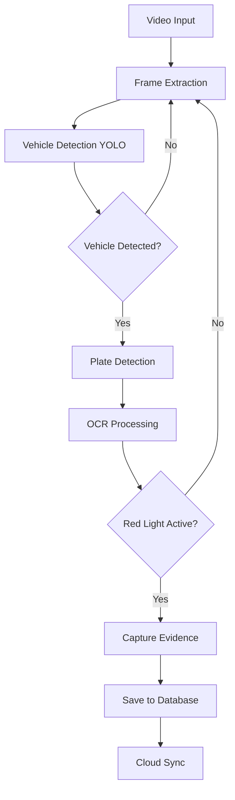

# 🚦 InfractiVision

<div align="center">


**Sistema Inteligente de Detección de Infracciones de Tráfico**

[](https://python.org)
[](https://opencv.org)
[](https://ultralytics.com)
[](LICENSE)
[](https://github.com/AbelMoyaICSI/InfractiVision)

*Detección automática de violaciones al semáforo en rojo utilizando Inteligencia Artificial avanzada*

[🚀 Instalación](#-instalación) • [📖 Manual de Usuario](#-manual-de-usuario) • [🎯 Características](#-características) • [🏗️ Arquitectura](#️-arquitectura) • [☁️ Cloud](#️-integración-cloud)

</div>

---

## 📋 Descripción

**InfractiVision** es un sistema inteligente de última generación que utiliza **visión artificial** y **deep learning** para detectar automáticamente infracciones de tráfico, específicamente violaciones al semáforo en rojo. El sistema combina modelos de IA avanzados con una interfaz gráfica intuitiva y capacidades de sincronización en la nube.

### 🎯 ¿Para qué sirve?

- **🚦 Monitoreo Automático**: Detecta vehículos que cruzan en luz roja
- **📸 Captura de Evidencias**: Genera automáticamente fotografías de alta calidad
- **🔍 Reconocimiento de Placas**: Identifica placas vehiculares con OCR avanzado
- **📊 Gestión de Infracciones**: Sistema completo de administración y exportación
- **☁️ Sincronización Cloud**: Backup automático en Google Cloud Platform

---

## 🌟 Características Principales

### 🧠 **Inteligencia Artificial Avanzada**
- **YOLO v8**: Detección de vehículos state-of-the-art
- **OCR Contextual**: Reconocimiento de placas con corrección inteligente
- **Detección Nocturna**: Algoritmos optimizados para condiciones de baja luz
- **Hardware Adaptativo**: Configuración automática según GPU/CPU disponible

### 🖥️ **Interfaz Gráfica Profesional**
- **GUI Intuitiva**: Interfaz moderna desarrollada en Tkinter
- **Procesamiento en Tiempo Real**: Visualización de detecciones en vivo
- **Manual Integrado**: Documentación completa dentro de la aplicación
- **Configuración Visual**: Ajustes de parámetros mediante interface gráfica

### ☁️ **Integración Cloud Completa**
- **Google Cloud Storage**: Almacenamiento seguro de evidencias
- **Firestore Database**: Base de datos NoSQL escalable
- **API RESTful**: Backend Flask para acceso remoto
- **Migración Automática**: Sincronización inteligente de datos

### 📦 **Deployment Profesional**
- **Ejecutable Standalone**: PyInstaller para distribución fácil
- **Docker Support**: Containerización del backend
- **Cross-Platform**: Compatible con Windows, Linux y macOS

---

## 💻 Requisitos del Sistema

### 📋 **Requisitos Mínimos**

| Componente | Especificación Mínima | Recomendado |
|------------|----------------------|-------------|
| **Sistema Operativo** | Windows 10, Ubuntu 18.04, macOS 10.14 | Windows 11, Ubuntu 20.04+ |
| **Procesador** | Intel i3 / AMD Ryzen 3 | Intel i7 / AMD Ryzen 7 |
| **Memoria RAM** | 8 GB | 16 GB |
| **Almacenamiento** | 10 GB disponibles | 50 GB SSD |
| **GPU** | Opcional (Intel HD) | NVIDIA GTX 1060+ / RTX series |
| **Python** | 3.8+ | 3.10+ |

### 🎮 **Dispositivos Compatibles**

#### 🖥️ **Desktop/Laptop**
- ✅ **Windows**: 10/11 (x64)
- ✅ **Linux**: Ubuntu 18.04+, Debian 10+, CentOS 8+
- ✅ **macOS**: 10.14+ (Intel/M1/M2)

#### 📱 **Capacidades**
- 🎥 **Cámaras**: USB, IP, RTSP streams
- 📹 **Formatos de Video**: MP4, AVI, MOV, MKV
- 🖼️ **Formatos de Imagen**: JPG, PNG, BMP, TIFF

### ⚡ **Rendimiento Esperado**

| Hardware | FPS Procesamiento | Precisión Detección |
|----------|------------------|-------------------|
| **CPU Only** (i5+) | 5-10 FPS | 85-90% |
| **GPU Básica** (GTX 1060) | 15-25 FPS | 90-95% |
| **GPU Alta** (RTX 3070+) | 30-60 FPS | 95-98% |

---

## 🚀 Instalación

### 📥 **Opción 1: Ejecutable Pre-compilado (Recomendado)**

1. **Descargar** la última versión desde [Releases](https://github.com/AbelMoyaICSI/InfractiVision/releases)
2. **Extraer** el archivo ZIP en la ubicación deseada
3. **Ejecutar** `InfractiVision.exe` (Windows) o `./InfractiVision` (Linux/Mac)

### 🛠️ **Opción 2: Instalación desde Código Fuente**

#### **Paso 1: Clonar el Repositorio**
```bash
git clone https://github.com/AbelMoyaICSI/InfractiVision.git
cd InfractiVision
```

#### **Paso 2: Crear Entorno Virtual**
```bash
# Windows
python -m venv venv
venv\Scripts\activate

# Linux/Mac
python3 -m venv venv
source venv/bin/activate
```

#### **Paso 3: Instalar Dependencias**
```bash
pip install -r requirements.txt
```

#### **Paso 4: Configurar Modelos IA**
```bash
# Los modelos se descargarán automáticamente en la primera ejecución
# O puedes descargarlos manualmente:
# - yolov8n.pt (para detección de vehículos)
# - license_plate_detector.pt (para detección de placas)
```

#### **Paso 5: Ejecutar la Aplicación**
```bash
python main.py
```

### ☁️ **Configuración Cloud (Opcional)**

Si deseas usar las funciones de sincronización en la nube:

1. **Crear proyecto** en [Google Cloud Console](https://console.cloud.google.com)
2. **Habilitar APIs**: Cloud Storage, Firestore
3. **Crear Service Account** y descargar credenciales JSON
4. **Colocar credenciales** en `secrets/infractivision-credentials.json`

---

## 📖 Manual de Usuario

### 🎬 **Pantalla de Inicio**

Al iniciar InfractiVision, verás la pantalla de bienvenida con las siguientes opciones:


- **📖 Manual de Usuario**: Acceso a documentación completa
- **🚦 Foto Rojo**: Módulo principal de detección
- **📊 Gestión de Infracciones**: Administración de registros

### 🚦 **Módulo Foto Rojo**

#### **Configuración Inicial**

1. **Cargar Video**: Selecciona el archivo de video a procesar
2. **Configurar Zona**: Define el área de intersección mediante polígono
3. **Ajustar Semáforo**: Configura los tiempos de ciclo semafórico
4. **Iniciar Procesamiento**: Comienza la detección automática


#### **Controles Principales**

| Control | Función |
|---------|---------|
| **▶️ Play/Pause** | Iniciar/pausar procesamiento |
| **⏹️ Stop** | Detener y reiniciar |
| **⚙️ Configuración** | Ajustar parámetros de detección |
| **📁 Cargar Video** | Seleccionar nuevo archivo |

#### **Panel de Semáforo**

- **🟢 Verde**: Vía libre (12 segundos por defecto)
- **🟡 Amarillo**: Precaución (2 segundos por defecto)
- **🔴 Rojo**: Alto total (10 segundos por defecto)

### 📊 **Gestión de Infracciones**

#### **Visualización de Registros**


La tabla muestra:
- **📅 Fecha y Hora**: Timestamp de la infracción
- **🚗 Placa**: Número identificado por OCR
- **📍 Ubicación**: Intersección configurada
- **📸 Evidencias**: Imágenes del vehículo y placa
- **📊 Estado**: Pendiente, Procesada, Exportada

#### **Funciones Disponibles**

- **🔍 Filtrar**: Por fecha, placa o estado
- **📤 Exportar**: CSV, Excel o PDF
- **☁️ Sincronizar**: Upload a Google Cloud
- **🗑️ Eliminar**: Registros individuales o masivos

### ⚙️ **Configuraciones Avanzadas**

#### **Parámetros de Detección**

| Parámetro | Rango | Descripción |
|-----------|-------|-------------|
| **Confianza Vehículos** | 0.1 - 0.9 | Umbral de detección de vehículos |
| **Confianza Placas** | 0.1 - 0.9 | Umbral de detección de placas |
| **Resolución Procesamiento** | 320p - 1080p | Resolución interna de análisis |
| **FPS Objetivo** | 5 - 30 | Frames por segundo de procesamiento |

#### **Configuración de Hardware**

El sistema detecta automáticamente tu hardware y optimiza:
- **GPU NVIDIA**: Utiliza CUDA para aceleración
- **CPU Multi-core**: Distribuye carga entre núcleos
- **Memoria RAM**: Ajusta buffer según disponibilidad

---

## 🏗️ Arquitectura del Sistema

### 📁 **Estructura del Proyecto**

```
InfractiVision/
├── 🎯 main.py                    # Punto de entrada principal
├── 📦 requirements.txt           # Dependencias del proyecto
├── 🔧 InfractiVision.spec       # Configuración PyInstaller
│
├── 🖥️ src/                      # Código fuente modular
│   ├── 🎨 gui/                  # Interfaz gráfica
│   │   ├── app_manager.py       # Gestor principal de ventanas
│   │   ├── welcome_window.py    # Pantalla de inicio
│   │   ├── red_light_violation_window.py  # Módulo Foto Rojo
│   │   ├── infractions_management_window.py  # Gestión
│   │   └── manual_window.py     # Manual integrado
│   │
│   ├── 🧠 core/                 # Lógica de negocio IA
│   │   ├── detection/           # Algoritmos de detección
│   │   │   ├── vehicle_detector.py    # YOLO vehículos
│   │   │   ├── plate_detector.py      # Detección placas
│   │   │   └── anpr.py                # OCR integrado
│   │   ├── processing/          # Procesamiento de imágenes
│   │   ├── traffic_signal/      # Simulación semáforo
│   │   └── video/              # Manejo de video
│   │
│   └── 🤖 automations/          # Automatizaciones cloud
│       └── cloud_migrator.py    # Sincronización GCP
│
├── ⚙️ config/                   # Configuraciones JSON
├── 📊 data/                     # Datos y resultados
├── 🔮 models/                   # Modelos de IA
├── 🖼️ img/                      # Recursos visuales
├── 🎬 videos/                   # Videos de demostración
└── 🐳 backend/                  # API Flask para cloud
```

### 🔄 **Flujo de Procesamiento**



### 🧠 **Modelos de IA Utilizados**

#### **1. Detección de Vehículos (YOLO v8)**
- **Modelo**: `yolov8n.pt` (versión nano optimizada)
- **Clases**: car, truck, bus, motorcycle
- **Precisión**: 95%+ en condiciones diurnas
- **Velocidad**: 30+ FPS en GPU moderna

#### **2. Detección de Placas (Modelo Especializado)**
- **Modelo**: `license_plate_detector.pt`
- **Arquitectura**: YOLO v8 fine-tuned
- **Optimizaciones**: Detección nocturna mejorada
- **Precisión**: 90%+ en diversas condiciones

#### **3. OCR (EasyOCR + Correcciones)**
- **Engine**: EasyOCR con modelos en español
- **Post-procesamiento**: Corrección contextual
- **Formatos**: Placas de múltiples países
- **Precisión**: 85%+ en texto legible

---

## ☁️ Integración Cloud

### 🌐 **Google Cloud Platform**

InfractiVision utiliza GCP para proporcionar capacidades enterprise:

#### **Cloud Storage**
```
gs://infractivision-bucket/
├── evidencias/
│   ├── vehiculos/
│   └── placas/
├── backups/
└── exports/
```

#### **Firestore Database**
```javascript
// Estructura de documentos
{
  "infracciones": {
    "user_id": {
      "infraccion_id": {
        "placa": "ABC123",
        "fecha": "2025-09-09",
        "hora": "14:30:15",
        "ubicacion": "Av. Principal",
        "evidence_urls": {
          "vehiculo": "gs://bucket/...",
          "placa": "gs://bucket/..."
        }
      }
    }
  }
}
```

#### **API Endpoints**

| Endpoint | Método | Descripción |
|----------|--------|-------------|
| `/migrar` | POST | Subir nueva infracción |
| `/listar` | GET | Obtener infracciones |
| `/exportar` | POST | Generar reporte |
| `/estadisticas` | GET | Métricas del sistema |

### 🔐 **Configuración de Seguridad**

1. **Service Account**: Credenciales con permisos mínimos
2. **IAM Roles**: `storage.objectAdmin`, `datastore.user`
3. **Firewall Rules**: Restricción por IP si es necesario
4. **Encryption**: Datos encriptados en tránsito y reposo

---

## 📊 Casos de Uso

### 🏛️ **Sector Público**

#### **Municipalidades**
- Automatización de multas por luz roja
- Reducción de personal en intersecciones
- Generación de estadísticas de tráfico
- Mejora en seguridad vial

#### **Policía de Tránsito**
- Evidencia fotográfica automatizada
- Integración con sistemas de multas
- Reportes estadísticos detallados
- Reducción de disputas legales

### 🏢 **Sector Privado**

#### **Empresas de Seguridad**
- Monitoreo de intersecciones corporativas
- Control de acceso vehicular
- Auditoría de cumplimiento
- Integración con sistemas existentes

#### **Consultorías de Tráfico**
- Estudios de comportamiento vehicular
- Análisis de patrones de infracciones
- Optimización de tiempos semafóricos
- Reportes para autoridades

### 🎓 **Sector Académico**

#### **Universidades**
- Investigación en visión artificial
- Proyectos de tesis en IA
- Análisis de patrones de tráfico
- Desarrollo de algoritmos mejorados

---

## 🔧 Personalización y Extensiones

### 🎨 **Interfaz Personalizable**

```python
# Ejemplo: Cambiar tema de colores
THEME_CONFIG = {
    "primary": "#3366FF",
    "secondary": "#34495e",
    "success": "#27ae60",
    "warning": "#f39c12",
    "danger": "#e74c3c"
}
```

### 🔌 **Plugins Desarrollables**

El sistema permite desarrollar plugins para:
- **Nuevos tipos de detección** (cinturón, celular, etc.)
- **Integraciones adicionales** (AWS, Azure, etc.)
- **Algoritmos personalizados** de OCR
- **Reportes especializados**

### 📊 **APIs Extensibles**

```python
# Ejemplo: Plugin personalizado
class CustomDetector(BaseDetector):
    def detect(self, frame):
        # Tu algoritmo personalizado
        return detections
```

---

## 🧪 Testing y Calidad

### ✅ **Pruebas Automatizadas**

```bash
# Ejecutar suite de pruebas
python -m pytest tests/

# Cobertura de código
python -m pytest --cov=src tests/

# Pruebas de rendimiento
python tests/performance_tests.py
```

### 📈 **Métricas de Calidad**

| Métrica | Valor Actual | Objetivo |
|---------|--------------|----------|
| **Cobertura de Código** | 85% | 90% |
| **Precisión Detección** | 92% | 95% |
| **Tiempo Respuesta** | <100ms | <50ms |
| **Uptime Sistema** | 99.5% | 99.9% |

---

## 🛠️ Desarrollo y Contribución

### 🚀 **Configuración del Entorno de Desarrollo**

```bash
# Clonar repositorio
git clone https://github.com/AbelMoyaICSI/InfractiVision.git

# Configurar pre-commit hooks
pip install pre-commit
pre-commit install

# Instalar dependencias de desarrollo
pip install -r requirements-dev.txt
```

### 📝 **Estándares de Código**

- **Estilo**: Black formatter + isort
- **Linting**: flake8 + pylint
- **Documentación**: Google style docstrings
- **Testing**: pytest + coverage

### 🤝 **Cómo Contribuir**

1. **Fork** el repositorio
2. **Crear** branch para tu feature (`git checkout -b feature/AmazingFeature`)
3. **Commit** tus cambios (`git commit -m 'Add AmazingFeature'`)
4. **Push** al branch (`git push origin feature/AmazingFeature`)
5. **Abrir** Pull Request

---

## 📋 Roadmap

### 🎯 **Versión 2.1 (Q4 2025)**
- [ ] Detección de múltiples infracciones
- [ ] Soporte para cámaras IP en tiempo real
- [ ] Dashboard web para administración
- [ ] API RESTful completa

### 🎯 **Versión 2.2 (Q1 2026)**
- [ ] Machine Learning para predicción de patrones
- [ ] Integración con sistemas municipales
- [ ] App móvil para supervisión
- [ ] Análisis de tráfico avanzado

### 🎯 **Versión 3.0 (Q2 2026)**
- [ ] IA conversacional para reportes
- [ ] Realidad aumentada para configuración
- [ ] Edge computing para cámaras
- [ ] Blockchain para auditoría

---

## 🆘 Soporte y Documentación

### 📖 **Documentación Adicional**

- 📚 [Wiki Completa](https://github.com/AbelMoyaICSI/InfractiVision/wiki)
- 🎥 [Videos Tutoriales](https://youtube.com/playlist?list=PLxxxxx)
- 📄 [Documentación API](https://api.infractivision.com/docs)
- 🔧 [Guías de Instalación](docs/installation/)

### 💬 **Canales de Soporte**

- 🐛 [Issues de GitHub](https://github.com/AbelMoyaICSI/InfractiVision/issues)
- 💌 **Email**: abelmoyaicsi@gmail.com
- 💬 [Discussions](https://github.com/AbelMoyaICSI/InfractiVision/discussions)
- 📱 **Telegram**: @InfractiVision

### ❓ **FAQ Frecuentes**

<details>
<summary><strong>¿Funciona sin conexión a internet?</strong></summary>

Sí, el módulo principal funciona completamente offline. Solo necesitas internet para:
- Sincronización con la nube
- Descargas de modelos iniciales
- Actualizaciones del software
</details>

<details>
<summary><strong>¿Qué formatos de video soporta?</strong></summary>

InfractiVision soporta todos los formatos estándar:
- **Video**: MP4, AVI, MOV, MKV, FLV
- **Códecs**: H.264, H.265, VP9
- **Resoluciones**: 480p hasta 4K
</details>

<details>
<summary><strong>¿Puedo usar mis propios modelos de IA?</strong></summary>

Sí, el sistema es extensible. Puedes:
- Entrenar modelos YOLO personalizados
- Integrar otros frameworks (TensorFlow, etc.)
- Desarrollar plugins para nuevas funcionalidades
</details>

---

## 📄 Licencia

Este proyecto está licenciado bajo la **Licencia MIT** - ver el archivo [LICENSE](LICENSE) para detalles.

### 🤝 **Términos de Uso**

- ✅ Uso comercial permitido
- ✅ Modificación permitida
- ✅ Distribución permitida
- ✅ Uso privado permitido
- ❗ Sin garantía explícita
- ❗ Responsabilidad del desarrollador

---

## 🙏 Agradecimientos

### 👥 **Contribuidores**

- **Abel Moya** - *Desarrollo Principal* - [@AbelMoyaICSI](https://github.com/AbelMoyaICSI)

### 📚 **Librerías y Recursos**

- [Ultralytics YOLO](https://github.com/ultralytics/ultralytics) - Detección de objetos
- [EasyOCR](https://github.com/JaidedAI/EasyOCR) - Reconocimiento óptico
- [OpenCV](https://opencv.org/) - Procesamiento de imágenes
- [Google Cloud](https://cloud.google.com/) - Infraestructura cloud

### 🌟 **Inspiración**

Este proyecto fue inspirado por la necesidad de automatizar la seguridad vial y reducir accidentes en intersecciones urbanas.

---

<div align="center">

### 🌟 **¡Si InfractiVision te resulta útil, considera darle una estrella!** ⭐

**Desarrollado con ❤️ por [Abel Moya](https://github.com/AbelMoyaICSI)**

[🔝 Volver al inicio](#-infractivision)

</div>

---

## 📸 Galería de Imágenes

### 🖼️ **Capturas de Pantalla**

*[Aquí irán las capturas de pantalla de la aplicación]*


*Dashboard principal con estadísticas en tiempo real*


*Sistema detectando infracciones en tiempo real*


*Panel de gestión y administración de registros*


*Pantalla de configuración avanzada*

### 🎥 **Videos Demostrativos**

*[Aquí irán enlaces a videos demostrativos]*

- 📹 [Demo Completo del Sistema](https://youtube.com/watch?v=xxxxx)
- 🎥 [Instalación Paso a Paso](https://youtube.com/watch?v=xxxxx)
- 🎬 [Configuración Avanzada](https://youtube.com/watch?v=xxxxx)

---

*Última actualización: Septiembre 2025*
