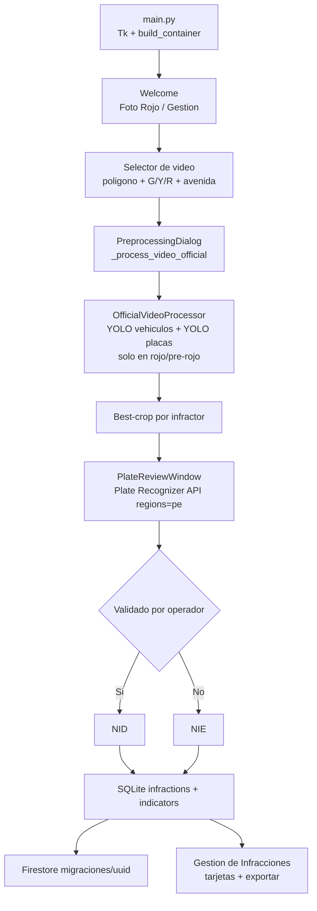

# 🚦 InfractiVision

**Sistema de detección de cruces en rojo en video grabado: YOLO + validación humana + Plate Recognizer API + SQLite + Firestore.**

Flujo offline por video: eliges un archivo, configuras polígono y tiempos del semáforo, procesas, validas placas y se migra a la nube.

> Detalle con diagramas: [DOC.md](DOC.md).

---

## Qué hace

- **Detecta cruces en rojo**: solo cuenta el cruce del polígono durante fase roja (+ 0.5 s pre-rojo) del ciclo G → Y → R simulado.
- **Trackea sin duplicar**: un ID por vehículo (`CentroidVehicleTracker`).
- **Recorta la mejor placa por infractor**: YOLO de placas sobre el cuadrante inferior + scoring de calidad.
- **Lee placas una sola vez, al final**: `PlateReviewWindow` valida cada crop contra **Plate Recognizer API** (`regions=pe`), con corrección manual del operador.
- **Persiste y migra**: SQLite local como fuente única → Firestore al completar la validación.

---

## 🔄 Flujo



Referencias: `src/application/use_cases/process_violation_video.py:215`, `src/gui/preprocessing_dialog.py:1356`, `src/presentation/gui/plate_review_window.py:17`, `src/automations/firestore_migrator.py:165`.

Cómo funciona por dentro:

1. `TrafficProcessingPlanner` calcula `state_at(frame)` con `t = (frame/fps) % (G+Y+R)`. Solo hay detección si `t >= red_start - 0.5s`.
2. YOLO vehículos (conf 0.40, clases car/bus/truck) → `CentroidVehicleTracker.update` → `cv2.pointPolygonTest` con el centro inferior del bbox (+ margen 80 px).
3. YOLO placas sobre el cuadrante inferior del vehículo. Si el crop no es viable (w<55 o h<30) queda como pendiente (NIE); si es viable se guarda el de mejor calidad.
4. Al terminar el video se abre `PlateReviewWindow`: un hilo pide a la API (~2 s entre requests, reintento en 429) y un poller `after(50)` pinta el resultado en Tk.
5. El operador corrige el texto y marca **Validar**. Solo eso cuenta como NID.
6. Al pulsar **Completado** se guarda en SQLite, se recalculan indicadores y un hilo `daemon` (`preprocessing_dialog.py:1508`) migra a Firestore.

---

## 🧰 Stack (solo lo usado)

| Capa | Tecnología | Versión | Dónde |
|------|-----------|---------|-------|
| Lenguaje | Python | 3.10 (`mise.toml`) | Todo |
| GUI | Tkinter (stdlib) + tkcalendar | — / 1.6.1 | `src/gui/*`, `src/presentation/gui/*` |
| Video | OpenCV | 4.9.0.80 | `VideoCapture`/`VideoWriter`, overlays, `pointPolygonTest` |
| Detección | YOLOv8 (`ultralytics`) | 8.4.120 | `yolov8n.pt` vehículos + `license_plate_detector.pt` placas |
| Deep Learning | PyTorch + CUDA 12.8 | 2.8.0+cu128 / 0.23.0+cu128 | Inferencia YOLO (`--extra-index-url` cu128 en `requirements.txt`) |
| OCR (único) | Plate Recognizer API (`requests`) | — | `cloud_plate_readers.py:62`, `read():100`, `regions=pe`, intervalo 2 s |
| Tracking | Centroide (`src/core`) | — | `process_violation_video.py:240` (DeepSORT solo en modo vivo por DI, no en video oficial) |
| Datos | NumPy / pandas / openpyxl | 1.26.4 / 2.1.4 / 3.1.5 | Scoring del crop, exportación CSV/Excel |
| Persistencia | SQLite | stdlib | `app_repository.py:45` — `infractions, video_configs, indicators, migrations, meta` |
| Migración | Firebase (`firebase-admin` + `google-cloud-firestore`) | 7.5.0 / 2.28.1 | `firestore_migrator.py:165` → `infractivision-e8c03`, `migraciones/{uuid}` |
| Build | PyInstaller | 6.11.1 | 5 specs, canónico `InfractiVision-ONEDIR-CUDA.spec` |

Modelos usados: `models/yolov8n.pt` y `models/license_plate_detector.pt` (descarga on-demand al primer arranque si faltan).

---

## 🚀 Instalación

```bash
git clone https://github.com/AbelMoyaICSI/InfractiVision.git
cd InfractiVision

python --version  # 3.10.x
python -m venv .venv
# Windows: .venv\Scripts\activate
# Linux/macOS: source .venv/bin/activate
pip install -r requirements.txt          # CUDA (oficial)
# o: pip install -r requirements-cpu.txt # sin GPU / macOS / CI

# Token de placas (requerido para validar):
# .env en la raíz:
# PLATE_RECOGNIZER_API_TOKEN="..."

python main.py
```

También hay ejecutable en [Releases](https://github.com/AbelMoyaICSI/InfractiVision/releases) (`InfractiVision.exe` / `./InfractiVision`).

Cloud opcional: sin el JSON del Service Account (`infractivision-e8c03-*.json` en raíz) la app funciona 100% offline; solo falla la migración.

En Linux: `sudo apt install python3-tk`.

---

## 📖 Uso

**0. Abrir:** `python main.py` (o doble clic en el `.exe`). Video: MP4/AVI/MOV/MKV, 720p mínimo, cámara estática con vista frontal a las placas.

**1. Inicio:** pulsa **Foto Rojo**.

**2. Elige video:** *Seleccionar*. Si dice *Sin configurar* → *Configurar*: dibuja el polígono sobre el cruce (doble clic cierra), pon avenida (ej. `Av. Condorcanqui - Trujillo`) y tiempos G/Y/R (ej. 12/2/10).

**3. Verifica:** dale *Play*. El banner `SEMÁFORO EN ROJO` y el timer G/Y/R deben cuadrar con el video.

**4. Procesa:** **INICIAR PROCESAMIENTO DE INFRACCIONES**. Corre en hilo worker con barra de progreso; no cierres la ventana.

**5. Valida placas:** revisa crop por crop, espera el texto de la API, corrige a mano si hace falta (`ABC-123`), marca **Validar** solo en las correctas y pulsa **Completado** → guarda en SQLite y migra a Firestore.

**6. Revisa:** **Gestión de Infracciones** — tarjetas NID (verde) / NIE (ámbar), filtros por fecha/placa, *Cargar más* (10 en 10), exportar CSV/Excel/PDF, historial de migraciones.

---

## 📊 Indicadores

Calculados en `AppRepository.compute_indicators_report()` (`app_repository.py:381`), iguales en SQLite, panel y Firestore:

| Indicador | Significado | Fórmula |
|-----------|-------------|---------|
| **NID** | Validadas con placa | evidencias con check ✓ |
| **NIE** | Pendientes | sin placa viable + no validadas |
| **TI** | Tasa de infracciones (%) | `NID / (NID+NIE) * 100` |
| **TR** | Minutos por infracción validada | `duración video (min) / NID` |

Config por video (`video_config_repository.py:10`): `polygon`, `green/yellow/red`, `avenue`, `danger_zone_margin_pixels=80`, `pre_red_seconds=0.5`, `green_skip_rate=60` (desde `config/polygon_config.json`, `time_presets.json`, `avenue_config.json`).

Documento Firestore `migraciones/{uuid}`:

```json
{
  "ti": 75.0, "tr": 0.42, "NID": 3, "NIE": 1,
  "video-name": "Av-Condorcanqui.mp4",
  "fecha": "2026-08-19T14:30:00",
  "settings": {"red": 10, "green": 12, "yellow": 2, "polygon": [{"x": 200, "y": 300}]},
  "deteccion": [{"placa": "T4A-123", "timestamp": "...", "confianza": 0.87, "validate": true}]
}
```

---

## 📦 Build y tests

```bash
# Build canónico CUDA ONEDIR + ZIP para Releases
python scripts/build_online.py --variant cuda --zip
# CPU (sin GPU / macOS)
python scripts/build_online.py --variant cpu --zip

# Tests
python -m pytest tests/ -v
python scripts/ci_smoke_test.py
# Regenerar indicadores desde SQLite
python scripts/regenerar_indicadores.py
```

Release por CI: `git tag vX.Y.Z && git push origin vX.Y.Z` (`release.yml`). Secrets: `FIREBASE_SA_JSON`, `PLATE_RECOGNIZER_TOKEN`.

---

## Licencia

MIT.
